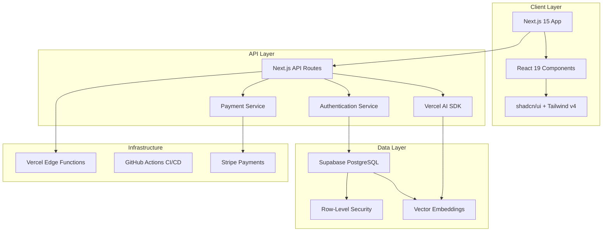
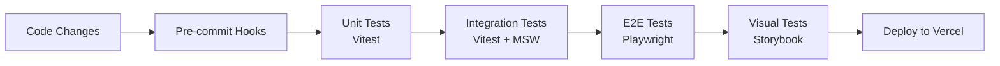

# LattixIQ - Your Personal Rationality Toolkit 🧠

<div align="center">

[](https://nextjs.org/)
[](https://www.typescriptlang.org/)
[](https://tailwindcss.com/)
[](https://supabase.com/)

*Transform passive knowledge into applied wisdom through personalized learning journeys*

[Live Demo](#) • [Documentation](./docs) • [Report Bug](https://github.com/dhargitai/lattixiq/issues) • [Request Feature](https://github.com/dhargitai/lattixiq/issues)

</div>

## 🌟 The Vision

**LattixIQ** is your personal rationality toolkit that helps you build a comprehensive framework of mental models and cognitive bias awareness for navigating life's challenges. Rather than consuming passive content, you'll master proven problem-solving and decision-making frameworks through structured application using behavioral science techniques like IF-THEN journaling and spaced repetition. LattixIQ doesn't just teach you what to do – it bridges the critical gap between knowing and doing, transforming how you think by building a toolkit of mental frameworks that actually stick.

### Why LattixIQ?

- **🎯 Personalized Learning Paths**: AI analyzes your specific goals to create custom roadmaps of 5-7 mental models
- **🔄 Learn-Plan-Reflect Loop**: Structured methodology ensures concepts move from theory to practice
- **📊 Progress Tracking**: Visual roadmaps and reflection logs show your growth over time
- **🤖 AI-Powered Insights**: Advanced semantic matching connects the right mental models to your unique challenges
- **📱 Mobile-First Design**: Learn and reflect anywhere with our responsive, PWA-ready interface

## 🏗️ Architecture & Technical Excellence

### System Architecture



### Tech Stack Deep Dive

#### Frontend Excellence
- **Next.js 15.4** with App Router for optimal performance and SEO
- **React 19.1** leveraging the latest concurrent features
- **TypeScript** with strict mode for type safety across the codebase
- **Tailwind CSS v4** with CSS variables for dynamic theming
- **shadcn/ui** components customized for our design system
- **Zustand** for complex state management where needed

#### Backend Architecture
- **Serverless Functions** via Next.js API routes for infinite scalability
- **Supabase** providing PostgreSQL with Row-Level Security
- **Vercel AI SDK** for streaming LLM responses
- **Vector Embeddings** for semantic matching of mental models
- **Stripe Integration** for seamless payment processing

#### Development Workflow
- **Storybook v9** for component-driven development
- **Vitest** with browser mode for unit and integration testing
- **Playwright** for comprehensive E2E testing
- **GitHub Actions** for CI/CD pipeline
- **ESLint + Prettier** for consistent code quality

### 🧪 Testing Strategy



## 🚀 Getting Started

### Prerequisites

- Node.js 20.x or later
- npm 10.x or later
- Git

### Installation

```bash
# Clone the repository
git clone https://github.com/dhargitai/lattixiq.git
cd lattixiq

# Install dependencies
npm install

# Set up environment variables
cp .env.example .env.local
# Edit .env.local with your configuration

# Run development server
npm run dev
```

### Development Commands

```bash
# Development with Turbopack
npm run dev

# Run Storybook for component development
npm run storybook

# Run tests
npm test

# Run linting
npm run lint

# Build for production
npm run build

# Start production server
npm run start
```

## 🤝 Contributing

We welcome contributions! LattixIQ follows a structured development methodology to ensure code quality and consistency.

### Development Philosophy

1. **Component-Driven Development**: Build UI components in isolation using Storybook
2. **Test-Driven Development**: Write tests alongside features
3. **Type Safety First**: Leverage TypeScript's full potential
4. **Performance Obsessed**: Every component is optimized for speed
5. **Accessibility by Default**: WCAG 2.1 AA compliance

### Getting Started as a Contributor

1. **Fork the Repository**
   ```bash
   git clone https://github.com/dhargitai/lattixiq.git
   cd lattixiq
   npm install
   ```

2. **Understand the Architecture**
   - Read `/docs/architecture/` for system design
   - Review `/docs/epics/` for feature roadmap
   - Check `PROTOTYPE_COMPONENT_MAPPING.md` for UI specifications

3. **Pick an Issue**
   - Check our [issue tracker](https://github.com/yourusername/lattixiq/issues)
   - Look for `good-first-issue` labels
   - Comment on the issue to claim it

4. **Development Workflow**
   ```bash
   # Create a feature branch
   git checkout -b feature/your-feature-name
   
   # Develop with Storybook
   npm run storybook
   
   # Write/update tests
   npm test
   
   # Ensure code quality
   npm run lint
   
   # Commit with conventional commits
   git commit -m "feat: add new mental model component"
   ```

5. **Submit a Pull Request**
   - Ensure all tests pass
   - Update documentation if needed
   - Provide a clear PR description
   - Link related issues

### Code Style Guidelines

- Follow the existing patterns in `/components/ui/`
- Use semantic HTML and ARIA attributes
- Implement responsive design mobile-first
- Document complex logic with JSDoc comments
- Keep components small and focused

## 📚 Documentation

- **[Product Requirements](./docs/prd/)** - Comprehensive product vision and specifications
- **[Architecture Docs](./docs/architecture/)** - Technical architecture and design decisions
- **[Development Epics](./docs/epics/)** - Feature roadmap and implementation plans
- **[API Documentation](./docs/api/)** - API endpoints and integration guides
- **[Component Library](./stories/)** - Interactive component documentation in Storybook

## 🛠️ Project Structure

```
lattixiq/
├── app/                    # Next.js App Router pages
│   ├── (auth)/            # Authentication flows
│   ├── (app)/             # Main application routes
│   └── api/               # API routes
├── components/            
│   ├── ui/                # shadcn/ui components
│   └── features/          # Feature-specific components
├── lib/                   # Shared utilities and helpers
├── services/              # Business logic and API calls
├── hooks/                 # Custom React hooks
├── stores/                # Zustand state stores
├── tests/                 # Test suites and fixtures
├── docs/                  # Comprehensive documentation
└── stories/               # Storybook stories
```

## 🔮 Roadmap

### Phase 1: Foundation (Current)
- [x] Core architecture setup
- [x] Component library with Storybook
- [ ] Authentication flow
- [ ] Basic learning loop

### Phase 2: AI Integration
- [ ] Semantic vector search
- [ ] Personalized roadmap generation
- [ ] AI-powered journal analysis

### Phase 3: Growth Features
- [ ] Social learning features
- [ ] Advanced analytics
- [ ] Mobile app with React Native

## 🙏 Acknowledgments

- Mental models content adapted from leading rationality resources
- UI/UX inspired by modern learning platforms
- Built with love and caffeine ☕

---

<div align="center">

**[Website](#)** • **[Documentation](./docs)** • **[Community](#)** • **[Blog](#)**

Made with ❤️ by the LattixIQ Team

</div>