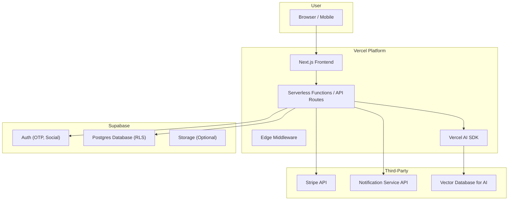
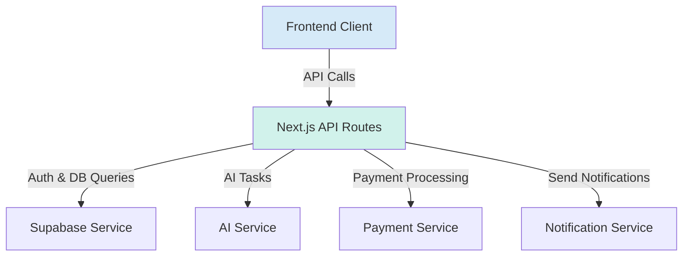
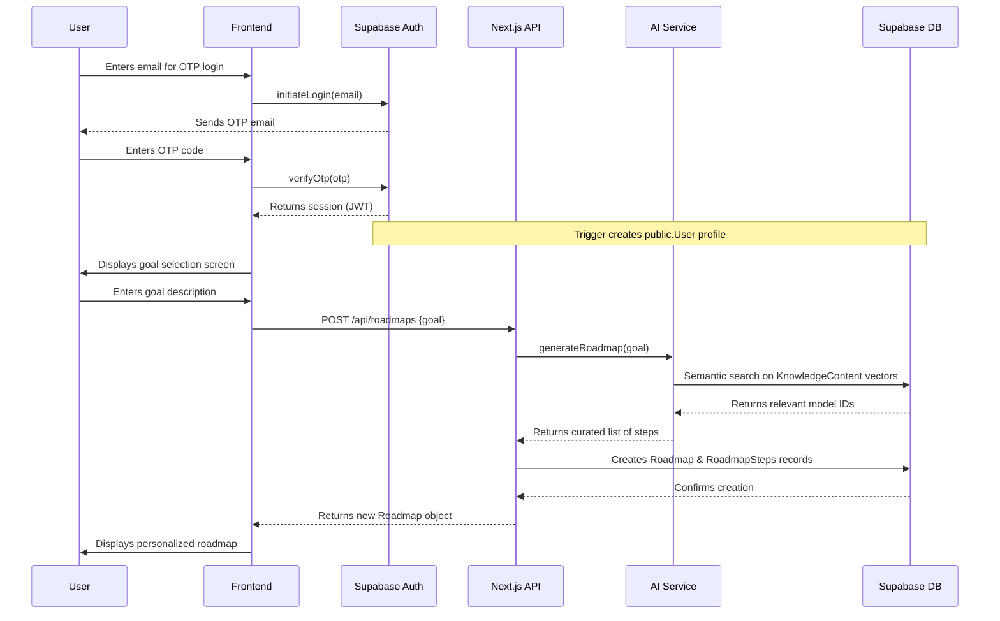
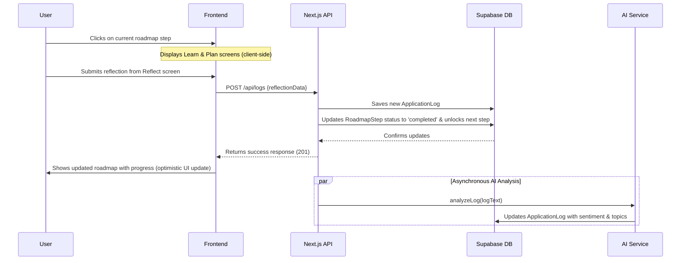
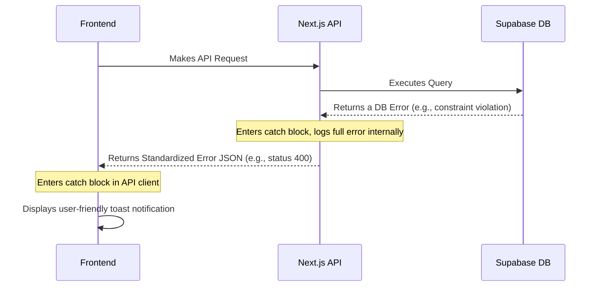

# **Fullstack Architecture Document for "LattixIQ"**

## **1. High-Level Architecture**

### Technical Summary:

This project will be a modern, serverless fullstack application built on Next.js and hosted on Vercel. User authentication and data persistence will be managed by Supabase, leveraging its Postgres database with Row-Level Security for data isolation. The frontend will be a responsive single-page application built with shadcn/ui and Tailwind CSS. AI-powered personalization for roadmap generation and journal analysis will be handled via the Vercel AI SDK. Stripe will be integrated for premium subscription payments. This architecture is designed for scalability, rapid development, and a seamless developer experience.

#### **High-Level Architecture Diagram:**



### Repository Structure:

Given the tightly integrated nature of Next.js, a Monorepo approach is recommended, even for a single application. We will use a standard Next.js App Router structure. This keeps frontend and backend code (API routes) in a single, cohesive codebase, simplifying development and deployment.

```
/lattixiq
├── /app                  # Next.js App Router
│   ├── /api              # API Routes
│   ├── /(app)            # Main application routes
│   ├── /(auth)           # Authentication routes (Login)
│   └── layout.tsx
├── /components           # Shared React components (shadcn)
├── /lib                  # Helper functions, DB clients, AI SDK config
├── /styles               # Global styles
├── /tests                # TDD Test Suites
│   ├── /integration
│   └── /unit
├── /supabase             # Supabase migration files
└── package.json
```

## **2. Tech Stack**

This section serves as the definitive, single source of truth for all technologies, frameworks, and services to be used in the LattixIQ project. All development must adhere to these choices and specified versions to ensure consistency and stability. 1111

| Category | Technology | Version | Purpose | Rationale |
| --- | --- | --- | --- | --- |
| **Frontend Language** | TypeScript | `~5.5.3` | Primary language for type safety in the frontend. | Ensures code quality, improves developer experience, and reduces runtime errors. |
| **Frontend Framework** | Next.js | `~15.0.0` | The core React framework for the application. | Provides a robust foundation with server-side rendering, static site generation, API routes, and a seamless developer experience. Aligns with Vercel platform. |
| **UI Components** | shadcn/ui | `~2.0.0` | The component library for building the user interface. | Provides accessible, unstyled components that can be fully customized with Tailwind, perfectly matching our "Serene Minimalist" aesthetic. |
| **Styling** | Tailwind CSS | `~4.0.0` | The utility-first CSS framework for all styling. | Enables rapid, consistent UI development and is the native styling solution for shadcn/ui. |
| **State Management** | Zustand | `~4.5.2` | For managing complex, shared client-side state. | A simple, fast, and scalable state management solution that avoids the boilerplate of more complex libraries. Will be used only where Next.js's native state management is insufficient. |
| **Backend** | Next.js API Routes | `~15.0.0` | For creating serverless API endpoints. | Tightly integrated with the frontend, providing a unified TypeScript codebase and simplifying the developer workflow. Deploys as serverless functions on Vercel. |
| **Database** | Supabase (Postgres) | `~15.x` | The primary database for all user data. | A powerful, open-source relational database. Supabase provides a managed solution with excellent tooling and Row-Level Security (RLS) for data privacy. |
| **Authentication** | Supabase Auth | `~2.0.0` | Handles all user authentication (Social & OTP). | Provides a secure, all-in-one solution for social logins (Google/Apple) and passwordless OTP, as required by the UI/UX spec. Integrates directly with database RLS. |
| **Payments** | Stripe SDK | `latest` | For processing premium subscription payments. | Industry standard for payments, providing robust APIs, security, and a pre-built customer portal to manage subscriptions. |
| **AI** | Vercel AI SDK | `~3.2.0` | For interacting with LLMs for personalization. | Simplifies streaming UI responses and connecting to various AI models, providing a seamless integration for our AI-powered features. |
| **Unit/Integration Tests** | Vitest | `~1.6.0` | For testing components and functions. | A modern, fast test runner. Its powerful in-memory mocking capabilities are ideal for creating the **sandboxed test environment** you require. |
| **E2E Testing** | Playwright | `~1.45.0` | For end-to-end testing of user flows. | A powerful browser automation tool that enables robust testing of both **happy and unhappy user paths** across different browsers. |
| **CI/CD** | GitHub Actions | `latest` | For continuous integration and deployment. | Native integration with GitHub. We will create workflows to run tests, linting, and deploy automatically to Vercel, ensuring quality control. |
| **Notifications** | To be determined | `N/A` | Handles sending app-related notification emails and push notifications. | We will build an abstracted `NotificationService` that can use any provider (e.g., Resend, Twilio) as an implementation detail, ensuring flexibility. |

## **3. Data Models**

This section defines the core data entities for the LattixIQ application. These models will be implemented as tables in our PostgreSQL database (storing all knowledge content and user data), managed by Supabase. The TypeScript interfaces will be shared between the frontend and backend (API Routes) to ensure type safety across the entire application.

### **1. User**

- **Purpose:** Stores user account information provided by Supabase Auth, along with application-specific preferences and state, including the testimonial tracking logic.
- **Key Attributes:**
    - `id` (UUID): Primary key, foreign key from `auth.users`.
    - `email` (Text): The user's email address.
    - `created_at` (Timestamp): Managed by Supabase.
    - `stripe_customer_id` (Text, Nullable): To link the user with their Stripe subscription data.
    - `subscription_status` (Enum: `free`, `premium`): The user's current payment plan.
    - **`testimonial_state` (Enum: `not_asked`, `asked_first`, `dismissed_first`, `submitted`, `asked_second`, `dismissed_second`): Tracks the state of the Senja testimonial request flow.**
    - `notification_prefs` (JSONB): Stores user preferences for notifications (e.g., `{ morning_digest_time: '08:00' }`).
- **TypeScript Interface:**
    
    ```tsx
    interface User {
      id: string;
      email: string;
      createdAt: string;
      stripeCustomerId?: string;
      subscriptionStatus: 'free' | 'premium';
      testimonialState: 'not_asked' | 'asked_first' | 'dismissed_first' | 'submitted' | 'asked_second' | 'dismissed_second';
      notificationPrefs: {
        morningDigestTime?: string;
        // ... other notification settings
      };
    }
    ```
    
- **Relationships:** A User `has many` Roadmaps, `has many` ApplicationLogs.

### **2. Roadmap**

- **Purpose:** Represents a single, personalized learning journey for a user, tied to a specific goal.
- **Key Attributes:**
    - `id` (UUID): Primary key.
    - `user_id` (UUID): Foreign key linking to the `User` table.
    - `goal_description` (Text): The user's stated goal for this roadmap (e.g., "Stop Procrastinating").
    - `status` (Enum: `active`, `completed`): The current state of the roadmap.
    - `created_at` (Timestamp): When the roadmap was generated.
    - `completed_at` (Timestamp, Nullable): When the user finished the last step.
- **TypeScript Interface:**
    
    ```tsx
    interface Roadmap {
      id: string;
      userId: string;
      goalDescription: string;
      status: 'active' | 'completed';
      createdAt: string;
      completedAt?: string;
    }
    ```
    
- **Relationships:** A Roadmap `belongs to` a User, `has many` RoadmapSteps.

### **3. RoadmapStep**

- **Purpose:** Represents a single, ordered step within a Roadmap, linking to a specific Mental Model or Bias.
- **Key Attributes:**
    - `id` (UUID): Primary key.
    - `roadmap_id` (UUID): Foreign key linking to the `Roadmap` table.
    - `knowledge_content_id` (UUID): Foreign key linking to the `KnowledgeContent` table.
    - `status` (Enum: `locked`, `unlocked`, `completed`): The user's progress on this step.
    - `order` (Integer): The numerical order of the step within the roadmap (e.g., 1, 2, 3...).
- **TypeScript Interface:**
    
    ```tsx
    interface RoadmapStep {
      id: string;
      roadmapId: string;
      knowledgeContentId: string;
      status: 'locked' | 'unlocked' | 'completed';
      order: number;
    }
    ```
    
- **Relationships:** A RoadmapStep `belongs to` a Roadmap, `has one` KnowledgeContent item.

### **4. ApplicationLog**

- **Purpose:** Stores the user's journal reflections from the "Reflect" screen. This is the core data for personalization.
- **Key Attributes:**
    - `id` (UUID): Primary key.
    - `user_id` (UUID): Foreign key to the `User`.
    - `roadmap_step_id` (UUID): Foreign key to the specific `RoadmapStep` this log is for.
    - `situation_text` (Text): The user's description of what happened.
    - `learning_text` (Text): The user's reflection on what they learned.
    - `effectiveness_rating` (Integer): The user's self-rated score from 1-5.
    - `ai_sentiment` (Enum, Nullable: `positive`, `negative`, `neutral`): Populated by our AI analysis.
    - `ai_topics` (Array of Text, Nullable): Populated by our AI analysis (e.g., `['career', 'self-doubt']`).
    - `created_at` (Timestamp).
- **TypeScript Interface:**
    
    ```tsx
    interface ApplicationLog {
      id: string;
      userId: string;
      roadmapStepId: string;
      situationText: string;
      learningText: string;
      effectivenessRating: number; // 1-5
      aiSentiment?: 'positive' | 'negative' | 'neutral';
      aiTopics?: string[];
      createdAt: string;
    }
    ```
    
- **Relationships:** An ApplicationLog `belongs to` a User and `belongs to` a RoadmapStep.

### **5. KnowledgeContent**

- **Purpose:** To be the single source of truth for all mental models, cognitive biases, and fallacies. This allows for dynamic content management.
- **Key Attributes:**
    - `id` (UUID): Primary key.
    - `title` (Text): The name of the model (e.g., "Inversion").
    - `category` (Text): The discipline (e.g., "Psychology").
    - `type` (Enum: `mental-model`, `cognitive-bias`, `fallacy`).
    - `summary` (Text): A brief, one-sentence explanation.
    - `description` (Text): The detailed explanation of the concept.
    - `application` (Text): General guidance on how to apply or spot the concept.
    - `keywords` (Array of Text): For filtering and search.
    - `embedding` (Vector): The vector embedding for semantic search, managed by `pgvector`.
- **TypeScript Interface:**
    
    ```tsx
    interface KnowledgeContent {
      id: string;
      title: string;
      category: string;
      type: 'mental-model' | 'cognitive-bias' | 'fallacy';
      summary: string;
      description: string;
      application: string;
      keywords: string[];
      // embedding is handled server-side
    }
    ```
    
- **Relationships:** `has many` GoalExamples, `has many` RoadmapSteps.

### **6. GoalExample**

- **Purpose:** To store personalized examples for applying knowledge to a specific goal. Normalizing this into a separate table is efficient.
- **Key Attributes:**
    - `id` (UUID): Primary key.
    - `knowledge_content_id` (UUID): Foreign key to the `KnowledgeContent` table.
    - `goal` (Text): The user goal category this example applies to (e.g., "Procrastination").
    - `if_then_example` (Text, Nullable): Example for a mental model.
    - `spotting_mission_example` (Text, Nullable): Example for a cognitive bias.
- **TypeScript Interface:**
    
    ```tsx
    interface GoalExample {
      id: string;
      knowledgeContentId: string;
      goal: string;
      ifThenExample?: string;
      spottingMissionExample?: string;
    }
    ```
    
- **Relationships:** `belongs to` one KnowledgeContent item.

### **Vector Database Integration**

We will leverage Supabase's built-in `pgvector` extension to handle semantic search, which keeps our architecture lean.

- **Workflow:**
    1. When a `KnowledgeContent` item is created or updated in our Postgres database, a Supabase Edge Function will automatically be triggered.
    2. This function will take the text fields (`title`, `description`, `application`), use the Vercel AI SDK to generate a vector embedding from them, and save the resulting embedding into the `embedding` column of that item.
    3. When a user sets a goal, the app's backend will perform a semantic search by comparing the user's vectorized goal against the `embedding` column directly in the database to find the most relevant content for their roadmap.

## **4. API Specification**

This section defines the API contract for LattixIQ. We will use **Next.js API Routes** to create RESTful serverless endpoints. This approach is tightly integrated with our chosen tech stack, providing end-to-end type safety when used with our shared TypeScript interfaces.

All endpoints will be protected by Supabase's server-side authentication helpers, ensuring that users can only access their own data.

### **Authentication**

Authentication itself (social login, OTP) is handled client-side by the Supabase Auth library. Our API will not have `/login` or `/register` endpoints. Instead, authenticated requests will include a Supabase JWT, which our API middleware will validate.

### **Resource: Roadmaps (`/api/roadmaps`)**

- **`POST /`**
    - **Description:** Creates a new, personalized roadmap for the authenticated user. This endpoint will trigger the AI-powered semantic search on the backend to generate the roadmap steps.
    - **Request Body:** `{ "goalDescription": "string" }`
    - **Response (201):** The newly created `Roadmap` object, including an array of its associated `RoadmapStep` objects.
- **`GET /active`**
    - **Description:** Fetches the user's currently active roadmap, if one exists.
    - **Request Body:** None.
    - **Response (200):** A single `Roadmap` object with its `RoadmapStep` objects, or `null` if none are active.
- **`GET /`**
    - **Description:** Fetches all of the user's roadmaps (active and completed).
    - **Request Body:** None.
    - **Response (200):** An array of `Roadmap` objects.

### **Resource: Application Logs (`/api/logs`)**

- **`POST /`**
    - **Description:** Submits a new journal reflection for a roadmap step. This action will trigger two backend processes: 1) Unlocking the next `RoadmapStep`. 2) Asynchronously sending the text content to the Vercel AI SDK for analysis (sentiment, topics).
    - **Request Body:** `{ "roadmapStepId": "string", "situationText": "string", "learningText": "string", "effectivenessRating": number }`
    - **Response (201):** The newly created `ApplicationLog` object.
- **`GET /`**
    - **Description:** Fetches all of the user's application logs.
    - **Request Body:** None.
    - **Response (200):** An array of `ApplicationLog` objects.

### **Resource: Knowledge Content (`/api/knowledge`)**

- **`GET /:id`**
    - **Description:** Fetches the detailed content for a single mental model or bias.
    - **Request Body:** None.
    - **Response (200):** A `KnowledgeContent` object, including an array of its associated `GoalExample` objects.

### **Resource: User (`/api/user`)**

- **`PATCH /me`**
    - **Description:** Updates the authenticated user's preferences or state.
    - **Request Body:** `{ "notificationPrefs"?: object, "testimonialState"?: "dismissed_first" | "submitted" | ... }`
    - **Response (200):** The updated `User` object.

### **Resource: Payments (`/api/payments`)**

- **`POST /create-checkout-session`**
    - **Description:** Creates a Stripe checkout session for a new subscription.
    - **Request Body:** `{ "priceId": "string" }`
    - **Response (200):** `{ "url": "string" }` (The URL to redirect the user to Stripe Checkout).
- **`POST /create-portal-session`**
    - **Description:** Creates a Stripe Customer Portal session for managing an existing subscription.
    - **Request Body:** None.
    - **Response (200):** `{ "url": "string" }` (The URL to redirect the user to the Stripe Portal).

## **5. System Components**

This architecture is composed of several distinct, interacting logical components. 1

### **1. Frontend Client**

- **Responsibility:** To provide a responsive, intuitive, and "Serene Minimalist" user interface. It handles all user interactions, manages client-side state, and communicates with the backend via the API.
- **Key Interfaces:** Interacts with the user's browser. Makes HTTP requests to the Next.js API Routes.
- **Dependencies:** Next.js API Routes.
- **Technology Stack:** Next.js (App Router), React, TypeScript, shadcn/ui, Tailwind CSS, Zustand.

### **2. Next.js API Routes (Backend Logic)**

- **Responsibility:** To act as the secure backend for the application. It handles all business logic, validates user requests, orchestrates calls to other services (Supabase, AI, Stripe), and returns data to the client.
- **Key Interfaces:** Provides a RESTful API for the Frontend Client.
- **Dependencies:** Supabase Service, AI Service, Payment Service, Notification Service.
- **Technology Stack:** Next.js (API Routes), TypeScript.

### **3. Supabase Service**

- **Responsibility:** To provide core backend-as-a-service functionality. This includes secure user authentication (social & OTP), a managed PostgreSQL database with Row-Level Security, and the `pgvector` extension for semantic search.
- **Key Interfaces:** Supabase Client SDK (for client-side auth), Supabase Server-side SDK (for data access from API Routes).
- **Dependencies:** None.
- **Technology Stack:** Supabase, PostgreSQL, pgvector.

### **4. AI Service**

- **Responsibility:** To handle all interactions with Large Language Models. This includes generating vector embeddings for our knowledge base and analyzing user journal entries for sentiment and topics.
- **Key Interfaces:** Vercel AI SDK.
- **Dependencies:** A vector-enabled database (our Supabase `pgvector` instance).
- **Technology Stack:** Vercel AI SDK, Supabase Edge Functions (for embedding generation).

### **5. Payment Service**

- **Responsibility:** To manage all subscription and payment-related tasks securely.
- **Key Interfaces:** Stripe API, Stripe Webhooks.
- **Dependencies:** Next.js API Routes (to handle webhook events).
- **Technology Stack:** Stripe SDK.

### **6. Notification Service**

- **Responsibility:** To send all application-related notifications (e.g., morning plan digests). This component is an abstraction layer to avoid vendor lock-in.
- **Key Interfaces:** A simple, internal `sendEmail` or `sendPush` function.
- **Dependencies:** A third-party email/push provider (e.g., Resend, Twilio).
- **Technology Stack:** To be determined (e.g., Resend SDK).

### **Component Interaction Diagram**

This diagram shows how these logical components interact to deliver the application's features.



## **6. Core Workflows**

This section maps out the step-by-step interactions between our System Components for the most critical user journeys. We will use sequence diagrams to visualize these flows. 1

### **Workflow 1: New User Registration & First Roadmap Creation**

This workflow covers the user's journey from their first visit to seeing their personalized roadmap, which is critical for user activation.



### **Workflow 2: Completing a Roadmap Step**

This workflow details the core engagement loop of the application: learning, planning, and reflecting to make progress.



## **7. Database Schema**

This section defines the PostgreSQL schema for the LattixIQ application. The schema includes tables, custom types (ENUMs), foreign key relationships, and the necessary configuration for `pgvector`. Row-Level Security (RLS) will be enabled to ensure data privacy.

### **Custom ENUM Types**

First, we define the custom types that will be used across our tables to ensure data consistency.

```sql
-- ENUM for subscription status
CREATE TYPE subscription_status AS ENUM ('free', 'premium');
-- ENUM for testimonial request tracking
CREATE TYPE testimonial_state AS ENUM ('not_asked', 'asked_first', 'dismissed_first', 'submitted', 'asked_second', 'dismissed_second');
-- ENUM for roadmap status
CREATE TYPE roadmap_status AS ENUM ('active', 'completed');
-- ENUM for roadmap step status
CREATE TYPE roadmap_step_status AS ENUM ('locked', 'unlocked', 'completed');
-- ENUM for AI sentiment analysis
CREATE TYPE ai_sentiment AS ENUM ('positive', 'negative', 'neutral');
-- ENUM for Knowledge Content type
CREATE TYPE knowledge_content_type AS ENUM ('mental-model', 'cognitive-bias', 'fallacy');
```

### **Table Definitions**

```sql
-- Enable the pgvector extension
CREATE EXTENSION IF NOT EXISTS vector;
-- Stores public user profile information, extending Supabase's auth.users
CREATE TABLE "public"."users" ( "id" uuid PRIMARY KEY NOT NULL REFERENCES auth.users(id) ON DELETE CASCADE, "email" text, "created_at" timestamptz DEFAULT now(), "stripe_customer_id" text, "subscription_status" subscription_status DEFAULT 'free'::subscription_status, "testimonial_state" testimonial_state DEFAULT 'not_asked'::testimonial_state, "notification_prefs" jsonb
);
-- Stores the structured content for each mental model, bias, etc.
CREATE TABLE "public"."knowledge_content" ( "id" uuid PRIMARY KEY DEFAULT gen_random_uuid(), "title" text NOT NULL, "category" text, "type" knowledge_content_type NOT NULL, "summary" text, "description" text, "application" text, "keywords" text[], "embedding" vector(1536) -- For OpenAI's text-embedding-ada-002 model
);
-- Stores personalized examples for applying knowledge to a specific goal
CREATE TABLE "public"."goal_examples" ( "id" uuid PRIMARY KEY DEFAULT gen_random_uuid(), "knowledge_content_id" uuid NOT NULL REFERENCES public.knowledge_content(id) ON DELETE CASCADE, "goal" text NOT NULL, "if_then_example" text, "spotting_mission_example" text
);
-- Represents a user's personalized learning journey
CREATE TABLE "public"."roadmaps" ( "id" uuid PRIMARY KEY DEFAULT gen_random_uuid(), "user_id" uuid NOT NULL REFERENCES public.users(id) ON DELETE CASCADE, "goal_description" text, "status" roadmap_status DEFAULT 'active'::roadmap_status, "created_at" timestamptz DEFAULT now(), "completed_at" timestamptz
);
-- Represents a single step within a roadmap
CREATE TABLE "public"."roadmap_steps" ( "id" uuid PRIMARY KEY DEFAULT gen_random_uuid(), "roadmap_id" uuid NOT NULL REFERENCES public.roadmaps(id) ON DELETE CASCADE, "knowledge_content_id" uuid NOT NULL REFERENCES public.knowledge_content(id), "status" roadmap_step_status DEFAULT 'locked'::roadmap_step_status, "order" smallint NOT NULL
);
-- Stores the user's journal reflections
CREATE TABLE "public"."application_logs" ( "id" uuid PRIMARY KEY DEFAULT gen_random_uuid(), "user_id" uuid NOT NULL REFERENCES public.users(id) ON DELETE CASCADE, "roadmap_step_id" uuid NOT NULL REFERENCES public.roadmap_steps(id) ON DELETE CASCADE, "situation_text" text, "learning_text" text, "effectiveness_rating" smallint, "ai_sentiment" ai_sentiment, "ai_topics" text[], "created_at" timestamptz DEFAULT now()
);
```

### **Data Structure for Vector Database Ingestion**

To provide the Vercel AI SDK with the richest possible context, you will need to summarize each mental model, cognitive bias, and logical fallacy into a structured JSON format. This format is designed for both semantic search and for directly populating content in the app.

Here is the proposed repeatable structure:

```json
{
  "id": "string",
  "title": "string",
  "category": "string (e.g., Psychology, Statistics, Philosophy)",
  "type": "enum('mental-model', 'cognitive-bias', 'fallacy')",
  "summary": "string (A single, concise sentence for quick displays)",
  "description": "string (A detailed paragraph explaining the concept)",
  "application": "string (General guidance on how to apply or spot this concept)",
  "goalExamples": [
    {
      "goal": "string (e.g., 'Procrastination', 'Decision Making')",
      "if_then_example": "string (A concrete 'If-Then' plan using the model)",
      "spotting_mission_example": "string (A mission to spot a bias in the wild)"
    }
  ],
  "keywords": ["string"]
}
```

**Why this structure is effective:**

- **`id`, `title`, `category`, `type`:** Provide essential metadata for filtering and organization.
- **`summary`, `description`, `application`:** These fields contain the core educational content. The AI will vectorize these for semantic search when generating roadmaps.
- **`goalExamples`:** This is the key to personalization. It allows the AI to pull specific, highly relevant examples when constructing the "Plan Screen" for a user with a matching goal.
- **`keywords`:** This allows for a hybrid search approach, combining keyword filtering with semantic search for more precise results.

### **Row-Level Security (RLS) Policies**

The following policies are the complete set required to secure our database. They ensure that users can only ever access and modify their own data, which is a critical security requirement.

#### 1. Table: users

This table links directly to auth.users. Users should be able to view and update their own profile information.

```sql
-- Enable RLS on the users table
ALTER TABLE public.users ENABLE ROW LEVEL SECURITY;
-- Policy: Users can view their own profile.
CREATE POLICY "Users can view their own profile"
ON public.users FOR SELECT
USING (auth.uid() = id);
-- Policy: Users can update their own profile.
CREATE POLICY "Users can update their own profile"
ON public.users FOR UPDATE
USING (auth.uid() = id);
```

#### 2. Table: roadmaps

Users have full control over their own roadmaps.

```sql
-- Enable RLS on the roadmaps table
ALTER TABLE public.roadmaps ENABLE ROW LEVEL SECURITY;
-- Policy: Users can view their own roadmaps.
CREATE POLICY "Users can view their own roadmaps"
ON public.roadmaps FOR SELECT
USING (auth.uid() = user_id);
-- Policy: Users can create their own roadmaps.
CREATE POLICY "Users can create their own roadmaps"
ON public.roadmaps FOR INSERT
WITH CHECK (auth.uid() = user_id);
-- Policy: Users can update their own roadmaps.
CREATE POLICY "Users can update their own roadmaps"
ON public.roadmaps FOR UPDATE
USING (auth.uid() = user_id);
-- Policy: Users can delete their own roadmaps.
CREATE POLICY "Users can delete their own roadmaps"
ON public.roadmaps FOR DELETE
USING (auth.uid() = user_id);
```

#### 3. Table: roadmap_steps

A user can access a step if they own the parent roadmap. This requires checking the parent roadmaps table.

```sql
-- Enable RLS on the roadmap_steps table
ALTER TABLE public.roadmap_steps ENABLE ROW LEVEL SECURITY;
-- Policy: Users can view the steps of their own roadmaps.
CREATE POLICY "Users can view steps for their own roadmaps"
ON public.roadmap_steps FOR SELECT
USING ( EXISTS ( SELECT 1 FROM roadmaps WHERE roadmaps.id = roadmap_steps.roadmap_id AND roadmaps.user_id = auth.uid() )
);
-- Policy: Users can insert steps into their own roadmaps.
CREATE POLICY "Users can insert steps for their own roadmaps"
ON public.roadmap_steps FOR INSERT
WITH CHECK ( EXISTS ( SELECT 1 FROM roadmaps WHERE roadmaps.id = roadmap_steps.roadmap_id AND roadmaps.user_id = auth.uid() )
);
-- Policy: Users can update steps in their own roadmaps.
CREATE POLICY "Users can update steps for their own roadmaps"
ON public.roadmap_steps FOR UPDATE
USING ( EXISTS ( SELECT 1 FROM roadmaps WHERE roadmaps.id = roadmap_steps.roadmap_id AND roadmaps.user_id = auth.uid() )
);
-- Policy: Users can delete steps from their own roadmaps.
CREATE POLICY "Users can delete steps from their own roadmaps"
ON public.roadmap_steps FOR DELETE
USING ( EXISTS ( SELECT 1 FROM roadmaps WHERE roadmaps.id = roadmap_steps.roadmap_id AND roadmaps.user_id = auth.uid() )
);
```

#### 4. Table: application_logs

Users have full control over their own application logs.

```sql
-- Enable RLS on the application_logs table
ALTER TABLE public.application_logs ENABLE ROW LEVEL SECURITY;
-- Policy: Users can view their own logs.
CREATE POLICY "Users can view their own logs"
ON public.application_logs FOR SELECT
USING (auth.uid() = user_id);
-- Policy: Users can create their own logs.
CREATE POLICY "Users can create their own logs"
ON public.application_logs FOR INSERT
WITH CHECK (auth.uid() = user_id);
-- Policy: Users can update their own logs.
CREATE POLICY "Users can update their own logs"
ON public.application_logs FOR UPDATE
USING (auth.uid() = user_id);
-- Policy: Users can delete their own logs.
CREATE POLICY "Users can delete their own logs"
ON public.application_logs FOR DELETE
USING (auth.uid() = user_id);
```

#### 5. Tables: knowledge_content & goal_examples

This is our public knowledge base. All authenticated users should be able to read this data, but nobody should be able to modify it through the public API. Modifications should only be done by an admin or service role key.

```sql
-- Enable RLS on the knowledge_content table
ALTER TABLE public.knowledge_content ENABLE ROW LEVEL SECURITY;
-- Policy: Authenticated users can read all knowledge content.
CREATE POLICY "Authenticated users can read knowledge content"
ON public.knowledge_content FOR SELECT
USING (auth.role() = 'authenticated');
-- Enable RLS on the goal_examples table
ALTER TABLE public.goal_examples ENABLE ROW LEVEL SECURITY;
-- Policy: Authenticated users can read all goal examples.
CREATE POLICY "Authenticated users can read goal examples"
ON public.goal_examples FOR SELECT
USING (auth.role() = 'authenticated');
```

## **8. Frontend Architecture**

This section provides the detailed technical guide for all frontend development. Adherence to these patterns is crucial for creating a maintainable, scalable, and consistent user interface.

### **Component Architecture**

- **Component Organization:** We will follow a tiered structure within the `/components` directory to ensure a clear separation of concerns.
    
    ```
    /components
    ├── /ui         # Raw, unstyled components from shadcn/ui (Button, Input, etc.)
    ├── /shared     # Application-specific, reusable components built from /ui components
    |   ├── RoadmapCard.tsx
    |   └── SiteHeader.tsx
    └── /features   # Components specific to a single feature or route
        ├── /settings
        |   └── NotificationToggles.tsx
        └── /roadmap
            └── Step.tsx
    ```
    
- **Component Template:** All new React components must follow this standard template for consistency.
    
    ```tsx
    // /features/roadmap/components/Step.tsx
    
    import * as React from 'react';
    import { cn } from '@/lib/utils'; // For combining Tailwind classes
    import { Button } from '@/components/ui/button';
    
    // 1. Define component props with TypeScript
    interface StepProps extends React.HTMLAttributes<HTMLDivElement> {
      stepNumber: number;
      title: string;
      status: 'locked' | 'unlocked' | 'completed';
    }
    
    // 2. Use React.forwardRef to allow for passing refs
    const Step = React.forwardRef<HTMLDivElement, StepProps>(
      ({ className, stepNumber, title, status, ...props }, ref) => {
    
        // 3. Component logic here
        const isLocked = status === 'locked';
    
        // 4. Return JSX
        return (
          <div
            className={cn(
              'flex items-center p-4 rounded-lg border',
              isLocked ? 'bg-muted text-muted-foreground' : 'bg-card',
              className
            )}
            ref={ref}
            {...props}
          >
            {/* Component content */}
            <p>{title}</p>
          </div>
        );
      }
    );
    Step.displayName = 'Step';
    
    export { Step };
    ```
    

### **State Management Architecture**

Our philosophy is to keep client-side state minimal. We will use a hierarchical approach:

1. **URL State:** Use Next.js `useSearchParams` for state that should be bookmarkable (e.g., filters).
2. **Local Component State:** Use `useState` and `useReducer` for state that is not shared.
3. **Global State (Zustand):** Use Zustand for complex global state that needs to be shared across many components, such as the user's profile or the active roadmap data.
- **Zustand Store Structure:** Stores will be created in `/lib/stores` and organized by domain.
    
    ```tsx
    // /lib/stores/user-store.ts
    import { create } from 'zustand';
    import { User } from '@/lib/types'; // Assuming shared types
    
    interface UserState {
      user: User | null;
      setUser: (user: User | null) => void;
      isLoading: boolean;
    }
    
    export const useUserStore = create<UserState>((set) => ({
      user: null,
      isLoading: true,
      setUser: (user) => set({ user, isLoading: false }),
    }));
    ```
    

### **Routing Architecture**

- **Route Organization:** We will use the Next.js App Router with route groups to organize routes without affecting the URL path.
    - `/(app)`: Contains all protected routes that are part of the main application experience (e.g., `/`, `/toolkit`).
    - `/(auth)`: Contains authentication routes like `/login`.
- **Protected Route Pattern:** Route protection will be handled by a single `middleware.ts` file at the root of the project. This middleware will check for a valid Supabase session and redirect unauthenticated users to the login page.
    
    ```tsx
    // /middleware.ts
    import { createServerClient } from '@supabase/ssr';
    import { NextResponse, type NextRequest } from 'next/server';
    
    export async function middleware(request: NextRequest) {
      // Logic to refresh session cookies
      // ... Supabase middleware boilerplate ...
    
      const { data: { session } } = await supabase.auth.getSession();
    
      // If user is not logged in and is trying to access a protected route
      if (!session && request.nextUrl.pathname.startsWith('/')) {
        // Assuming (app) routes are at root, adjust if needed
        return NextResponse.redirect(new URL('/login', request.url));
      }
    
      return response;
    }
    
    export const config = {
      matcher: [
        /*
         * Match all request paths except for the ones starting with:
         * - _next/static (static files)
         * - _next/image (image optimization files)
         * - favicon.ico (favicon file)
         * - api (API routes)
         * - auth (public auth routes)
         */
        '/((?!_next/static|_next/image|favicon.ico|api|auth).*)',
      ],
    };
    ```
    

## **9. Backend Architecture**

This section details the patterns for all server-side logic, which will be implemented as Next.js API Routes and deployed as Vercel Serverless Functions.

### **Service Architecture (Serverless)**

- **Function Organization:** We will follow a RESTful, resource-based structure within the `/app/api/` directory. Each resource will have its own folder, and different HTTP methods (GET, POST, PATCH, etc.) will be handled by exported functions within the `route.ts` file for that resource.
    
    ```
    /app
    └── /api
        ├── /roadmaps
        |   └── route.ts  // Handles POST to create, GET to list
        ├── /logs
        |   └── route.ts  // Handles POST to create
        └── /user
            └── /me
                └── route.ts // Handles PATCH to update user
    ```
    
- **API Route (Function) Template:** All new API routes must adhere to this template to ensure consistency in authentication, error handling, and response formatting.
    
    ```tsx
    // /app/api/roadmaps/route.ts
    import { type NextRequest, NextResponse } from 'next/server';
    import { createRouteHandlerClient } from '@supabase/auth-helpers-nextjs';
    import { cookies } from 'next/headers';
    import { z } from 'zod'; // For input validation
    
    // 1. Define input schema for validation
    const postSchema = z.object({
      goalDescription: z.string().min(10),
    });
    
    // 2. Handle POST requests
    export async function POST(request: NextRequest) {
      const supabase = createRouteHandlerClient({ cookies });
    
      try {
        // 3. Authenticate the user
        const { data: { session } } = await supabase.auth.getSession();
        if (!session) {
          return new NextResponse('Unauthorized', { status: 401 });
        }
    
        // 4. Validate the request body
        const body = await request.json();
        const validatedBody = postSchema.parse(body);
    
        // 5. Core business logic (e.g., call AI service, save to DB)
        // const newRoadmap = await createRoadmapForUser(session.user.id, validatedBody.goalDescription);
    
        // 6. Return a typed, consistent response
        return NextResponse.json({ data: newRoadmap }, { status: 201 });
    
      } catch (error) {
        // 7. Use a standardized error handler
        // is zod error, return 400, otherwise 500
        return new NextResponse('Internal Server Error', { status: 500 });
      }
    }
    ```
    

### **Database Architecture**

- **Schema Design:** The PostgreSQL schema is defined in Section 7 of this document. All schema changes must be managed via Supabase CLI migrations, which will be stored in the `/supabase/migrations` directory.
- **Data Access Layer:** API Routes **must not** contain raw database queries. All database interactions will be abstracted into a dedicated data access layer located in `/lib/db/`. This centralizes our data logic, makes it reusable, and simplifies testing.
    
    ```tsx
    // /lib/db/roadmaps.ts
    import { createServerClient } from '@supabase/ssr'; // Or other server client
    import { Roadmap } from '@/lib/types';
    
    // A function that encapsulates the logic for creating a roadmap
    export async function createRoadmap(
        supabase: ReturnType<typeof createServerClient>,
        userId: string,
        goal: string
    ): Promise<Roadmap> {
        const { data, error } = await supabase
            .from('roadmaps')
            .insert({ user_id: userId, goal_description: goal })
            .select()
            .single();
    
        if (error) {
            throw new Error('Failed to create roadmap in DB.');
        }
    
        return data;
    }
    ```
    

### **Authentication and Authorization**

- **Authentication Flow:** As detailed in the Core Workflows, authentication is handled by the Supabase client library and validated server-side in our middleware and API routes.
- **Authorization:** Authorization is enforced at two levels:
    1. **API Route Level:** Every API Route will check for a valid session to ensure a user is logged in.
    2. **Database Level:** PostgreSQL's Row-Level Security (RLS) provides the ultimate layer of protection, ensuring that even if an API bug were to exist, a user could never query or modify data that doesn't belong to them. The full RLS policies are detailed in Section 7.

## **10. Unified Project Structure**

This is the complete, top-down view of our project's monorepo. It serves as a map for all development, showing where every type of file and logic should reside.

```
/lattixiq/
├── .github/
│   └── /workflows/         # CI/CD pipelines (e.g., test on push, deploy on merge)
│       └── ci.yaml
├── .vscode/                # VSCode specific settings (e.g., recommended extensions)
├── /app/
│   ├── /api/               # Backend API Routes (Serverless Functions)
│   │   ├── /roadmaps/
│   │   │   └── route.ts
│   │   └── ...             # Other resource-based routes
│   ├── /(app)/             # Protected main application routes
│   │   ├── /                 # The main dashboard / roadmap view
│   │   │   └── page.tsx
│   │   └── /toolkit/         # The "My Toolkit" screen
│   │       └── page.tsx
│   ├── /(auth)/            # Public authentication routes
│   │   └── /login/
│   │       └── page.tsx
│   ├── layout.tsx            # Root layout for the entire app
│   └── global.css            # Global styles (imported by layout)
├── /components/
│   ├── /ui/                # Base shadcn/ui components (e.g., button.tsx)
│   ├── /shared/            # Reusable, app-specific components (e.g., RoadmapCard.tsx)
│   └── /features/          # Components tied to a specific feature/route
├── /lib/
│   ├── /db/                # Data Access Layer (e.g., roadmaps.ts)
│   ├── /stores/            # Zustand global state stores (e.g., user-store.ts)
│   ├── /ai/                # Vercel AI SDK setup and helper functions
│   ├── /types/             # Shared TypeScript interfaces (e.g., types.ts)
│   └── utils.ts            # General utility functions (e.g., `cn` for Tailwind)
├── /public/                # Static assets (images, fonts, etc.)
├── /supabase/
│   └── /migrations/        # Supabase database migration files
├── /tests/
│   ├── /e2e/               # Playwright End-to-End tests
│   ├── /integration/       # Vitest Integration tests
│   └── /unit/              # Vitest Unit tests
├── middleware.ts             # For protecting routes (authentication guard)
├── .env.local              # Local environment variables (NOT committed to git)
├── .eslintrc.json          # ESLint configuration for code style
├── next.config.mjs           # Next.js configuration
├── postcss.config.mjs        # PostCSS configuration for Tailwind
├── tailwind.config.ts      # Tailwind CSS configuration
└── tsconfig.json           # TypeScript configuration
```

## **11. Testing Strategy**

Our approach to testing is designed to build confidence with every commit, ensure quality, and enable rapid, safe iteration.

### **Testing Philosophy**

- **Approach: Test-Driven Development (TDD):** All new functionality will be developed following the TDD `Red-Green-Refactor` cycle.
    1. **Red:** Write a failing test that clearly defines the desired functionality or bug fix.
    2. **Green:** Write the simplest possible application code to make the test pass.
    3. **Refactor:** Clean up and optimize the application code, ensuring all tests continue to pass.
- **Guiding Principle (Kent C. Dodds):** We will follow the principle: *"Write tests. Not too many. Mostly integration."* This means we will prioritize tests that simulate real user interactions and provide high confidence, while using unit tests more sparingly for complex, isolated business logic.

### **Test Types and Organization**

- **Integration Tests (`/tests/integration/`):** This is the foundation of our test suite. These tests will verify that different parts of our application work together as intended. We will use **Vitest** and **React Testing Library**.
    - **Frontend:** We will test component interactions. For example, simulating a user filling out the "Reflect" form and clicking "Submit," then asserting that the correct API call was made.
    - **Backend:** We will test our API Routes by sending mock HTTP requests and asserting that they return the correct response and that the database was changed appropriately.
- **Unit Tests (`/tests/unit/`):** These will be used for pure, complex business logic that can be tested in isolation, such as a utility function for analyzing text or a complex state management hook.
- **End-to-End (E2E) Tests (`/tests/e2e/`):** These are our highest-level tests. Using **Playwright**, we will automate a real browser to verify critical user flows from start to finish. For V1, we will have E2E tests for:
    1. The complete User Registration & First Roadmap Creation flow.
    2. The full "Learn, Plan, Act, Reflect" loop for a single roadmap step.

### **Sandboxed Test Environment**

To meet the requirement of running tests securely without sensitive data, we will implement the following:

- **Mocked Services:** All external services will be mocked during testing. The Stripe API, Notification Service, and AI Service calls will be intercepted using **Mock Service Worker (MSW)** for frontend tests and **Vitest's built-in mocking** for backend tests.
- **Test Database:** All tests will run against a separate, dedicated test database in Supabase. The connection string for this database will be provided via a `.env.test` file, which is never committed to source control.
- **Environment Variables:** All secrets and API keys will be managed through environment variables. The `.env.test` file will contain only mock or safe credentials. Our CI pipeline on GitHub Actions will be configured to use these test variables.

### **Happy and Unhappy Path Coverage**

It is a strict requirement that tests are written for both successful and failure scenarios. Every feature must include tests that verify correct behavior when things go wrong.

- **Test Case Structure:** Test files will be structured to clearly separate these paths.
    
    ```tsx
    // Example for a test file in /tests/integration/api/roadmaps.test.ts
    
    describe('POST /api/roadmaps', () => {
    
      // --- Happy Path ---
      it('should create a roadmap and return 201 for an authenticated user with a valid goal', () => {
        // Test logic here
      });
    
      // --- Unhappy Paths ---
      it('should return 401 Unauthorized if no user is logged in', () => {
        // Test logic here
      });
    
      it('should return 400 Bad Request if the goalDescription is missing or too short', () => {
        // Test logic here
      });
    
      it('should return 500 Internal Server Error if the database fails', () => {
        // Test logic here
      });
    });
    ```
    

## **12. Coding Standards**

This section outlines the mandatory coding standards for the LattixIQ project. These rules are designed to produce a clean, predictable, and scalable codebase, making it easier for both human developers and AI agents to contribute effectively.

### **Core Principles (Functional Style)**

As you requested, we will adhere to a functional programming style to minimize bugs and improve code clarity.

- **Immutability:** Data structures must not be mutated directly. Always create new objects or arrays instead of changing existing ones.
    
    ```tsx
    // BAD: Mutates the original object (side effect)
    function addUserRole(user, role) {
      user.role = role; 
      return user;
    }
    
    // GOOD: Returns a new object, leaving the original unchanged (pure)
    function addUserRole(user, role) {
      return { ...user, role: role };
    }
    ```
    
- **Pure Functions / No Side Effects:** Functions should be deterministic. Given the same input, a function must always return the same output and have no observable effects on the outside world (like modifying a global variable or writing to a database). Database and API calls will be isolated in our Data Access Layer and API Routes, respectively.

### **Naming Conventions**

| Element Type | Convention | Example |
| --- | --- | --- |
| Components | `PascalCase` | `RoadmapCard.tsx` |
| Hooks | `useCamelCase` | `useActiveRoadmap.ts` |
| Functions / Variables | `camelCase` | `const userRoadmaps = ...` |
| Types / Interfaces | `PascalCase` | `interface RoadmapStep { ... }` |
| Database Tables/Columns | `snake_case` | `application_logs`, `user_id` |
| API Route Folders | `kebab-case` | `/app/api/roadmap-steps/` |
| Test Files | `*.test.ts` | `roadmaps.test.ts` |

### **Tooling for Enforcement**

These standards will be enforced automatically.

- **Linting (ESLint):** We will use a strict ESLint configuration with plugins for TypeScript, React, React Hooks, and Next.js to catch potential errors and style issues.
- **Formatting (Prettier):** A Prettier configuration will be committed to the repository to ensure all code has a consistent format. It will be configured to run automatically on save in VSCode and as a pre-commit hook.
- **CI Pipeline Check:** Our GitHub Actions workflow will include a mandatory "Lint & Format" step. **Pull requests will be blocked from merging if this check fails.** This makes adherence to our standards non-negotiable.

## **13. Error Handling Strategy**

This strategy defines a unified approach to error handling across the entire stack, ensuring that errors are caught, logged appropriately, and presented to the user in a clear and helpful manner.

### **Error Flow Diagram**

This diagram illustrates the flow of an error from the backend to the user.



### **Standardized API Error Format**

All errors returned from our API will follow a consistent JSON structure. This allows the frontend to handle them predictably.

```tsx
interface ApiError {
  error: {
    message: string; // User-friendly message for simple cases
    errorCode: string; // Machine-readable code for specific frontend logic
    details?: Record<string, any>; // Optional field for validation errors
  };
}
```

### **Backend Error Handling**

We will use a centralized helper function in the backend to ensure all errors are processed consistently.

- **Custom Error Class:** To better control HTTP status codes.
    
    ```tsx
    // /lib/errors.ts
    export class AppError extends Error {
      public readonly statusCode: number;
    
      constructor(message: string, statusCode: number = 500) {
        super(message);
        this.statusCode = statusCode;
      }
    }
    ```
    
- **Error Handling Logic:** API routes will use a `try/catch` block. The `catch` block will log the real error for debugging and return the standardized error format to the client.
    
    ```tsx
    // In an API Route file (/app/api/...)
    // ... inside the POST, GET, etc. function
    try {
      // ... business logic that might throw an error
    } catch (error) {
      console.error(error); // Full error is logged on the server
    
      if (error instanceof AppError) {
        return new NextResponse(
          JSON.stringify({ error: { message: error.message, errorCode: 'app_error' } }),
          { status: error.statusCode }
        );
      }
    
      // Generic server error
      return new NextResponse(
        JSON.stringify({ error: { message: 'An unexpected error occurred.', errorCode: 'internal_server_error' } }),
        { status: 500 }
      );
    }
    ```
    

### **Frontend Error Handling**

The frontend will use the `errorCode` from the API response to display appropriate user feedback, typically using a toast notification.

```tsx
// /lib/api-client.ts
import toast from 'react-hot-toast';

export async function createRoadmap(goal: string) {
  try {
    const response = await fetch('/api/roadmaps', {
      method: 'POST',
      body: JSON.stringify({ goalDescription: goal }),
      headers: { 'Content-Type': 'application/json' },
    });

    if (!response.ok) {
      // If the response is not OK, parse the error and throw it
      const errorPayload = await response.json();
      throw new Error(errorPayload.error.message || 'Failed to create roadmap.');
    }

    return await response.json();

  } catch (error) {
    // Catch the error and display a user-friendly toast notification
    toast.error(error.message || 'Something went wrong. Please try again.');
    // Return null or re-throw to be handled by the calling component
    return null; 
  }
}
```

## **14. Deployment Architecture**

### **Deployment Strategy**

We will use a Git-based, continuous deployment model powered by Vercel and GitHub.

- **Vercel for Frontend & API Routes:**
    1. The `main` branch in our GitHub repository will represent the production application.
    2. When a developer opens a Pull Request (PR), Vercel will automatically build and deploy a unique **Preview Environment**. This allows us to review and test every change in a live, isolated setting before it reaches production.
    3. When a PR is approved and merged into `main`, Vercel will automatically trigger a **Production Deployment**, pushing the changes live.
- **Supabase for Database Migrations:**
    - Database schema changes are **not** deployed automatically with the application code.
    - Developers will create migration files locally using the Supabase CLI. These files will be committed to the `/supabase/migrations/` directory in our repository.
    - Applying migrations to our Staging and Production databases will be a controlled step within our GitHub Actions pipeline, requiring manual approval for production releases to prevent accidental data loss.

### **CI/CD Pipeline (GitHub Actions)**

A `ci.yaml` workflow file will be created in `.github/workflows/`. This pipeline will run automatically on every Pull Request to enforce our quality and coding standards. **A Pull Request cannot be merged unless all of these checks pass.**

```yaml
## .github/workflows/ci.yaml
name: 'Continuous Integration'

on:
  pull_request:
    branches: [ main ]

jobs:
  ci-checks:
    runs-on: ubuntu-latest
    steps:
      - name: Checkout Repository
        uses: actions/checkout@v4

      - name: Setup Node.js
        uses: actions/setup-node@v4
        with:
          node-version: '20' # Matches our tech stack
          cache: 'npm'

      - name: Install Dependencies
        run: npm ci

      - name: Lint & Format Check
        run: npm run lint # Enforces coding standards

      - name: Run All Tests
        run: npm test # Runs our full Vitest suite in a sandboxed environment
        env:
          SUPABASE_URL: ${{ secrets.TEST_SUPABASE_URL }}
          SUPABASE_ANON_KEY: ${{ secrets.TEST_SUPABASE_ANON_KEY }}

      - name: Build Check
        run: npm run build # Ensures the application builds successfully
```

### **Environments**

We will maintain three distinct environments to ensure a stable and secure development lifecycle.

| Environment | Purpose | Infrastructure | URL Example |
| --- | --- | --- | --- |
| **Development** | Local development and testing. | Developer's machine | `http://localhost:3000` |
| **Preview** | Reviewing Pull Requests, E2E testing. | Vercel Preview Deployments, Staging Supabase Project | `lattixiq-feature-xyz.vercel.app` |
| **Production** | The live application for all users. | Vercel Production, Production Supabase Project | `lattixiq.com` |

## **15. Monitoring and Observability**

This section outlines our strategy for observing the health and performance of LattixIQ once it is live. Our approach is to use tools that are tightly integrated with our Vercel and Supabase stack for a seamless experience.

### **Monitoring Stack**

- **Frontend Performance:** **Vercel Analytics**. This is built into our hosting platform and provides privacy-friendly, real-world performance metrics, including Core Web Vitals (LCP, INP, CLS) and page load speeds across different devices and regions.
- **Backend Performance:** **Vercel Functions Logs & Supabase Dashboard**. All logs (`console.log`, `console.error`) from our API Routes will be automatically captured and searchable in the Vercel dashboard. The Supabase dashboard provides detailed analytics on database health, query performance, and API usage.
- **Error Tracking:** **Sentry**. We will integrate the Sentry SDK into our Next.js application. It will automatically capture, aggregate, and alert us on unhandled errors that occur on both the frontend and in our backend API routes. This allows for proactive bug detection and resolution.

### **Key Metrics to Monitor**

- **Frontend Metrics:**
    - **Core Web Vitals:** We will track LCP, INP, and CLS via Vercel Analytics to ensure a fast user experience.
    - **JavaScript Error Rate:** We will monitor the percentage of user sessions that are error-free via Sentry.
    - **API Call Health:** We will track the latency and error rates of API calls as observed from the client-side.
- **Backend Metrics:**
    - **API Route Performance:** We will monitor the invocation count, duration, and error rate (5xx status codes) of our serverless functions in the Vercel dashboard.
    - **Database Performance:** We will use the Supabase dashboard to monitor query performance, index hit rates, and overall database health.
    - **Authentication Rates:** We will monitor successful vs. failed login attempts via the Supabase Auth dashboard.