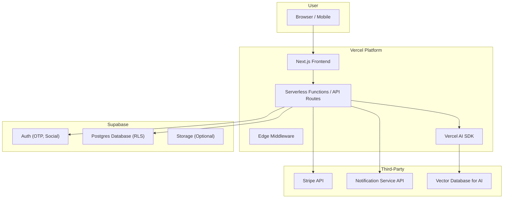

# **1. High-Level Architecture**

## Technical Summary:

This project is a modern, serverless fullstack application built on Next.js and hosted on Vercel. LattixIQ provides personalized mental models learning through AI-powered roadmap generation, IF-THEN planning systems, and reflection analysis. User authentication and data persistence are managed by Supabase with Postgres and Row-Level Security. The frontend is a responsive application built with shadcn/ui and Tailwind CSS. AI integration via Vercel AI SDK handles semantic matching of user goals to mental models, personalized content generation, and reflection pattern analysis. Stripe provides premium subscription management. This architecture enables scalable, personalized learning experiences with rapid development capabilities.

### **High-Level Architecture Diagram:**



## Repository Structure:

Given the tightly integrated nature of Next.js, a Monorepo approach is recommended, even for a single application. We will use a standard Next.js App Router structure. This keeps frontend and backend code (API routes) in a single, cohesive codebase, simplifying development and deployment.

```
/lattixiq
├── /app                  # Next.js App Router
│   ├── /api              # API Routes
│   ├── /(app)            # Main application routes
│   ├── /(auth)           # Authentication routes (Login)
│   └── layout.tsx
├── /components           # Shared React components (shadcn)
├── /lib                  # Helper functions, DB clients, AI SDK config
├── /styles               # Global styles
├── /tests                # TDD Test Suites
│   ├── /integration
│   └── /unit
├── /supabase             # Supabase migration files
└── package.json
```
