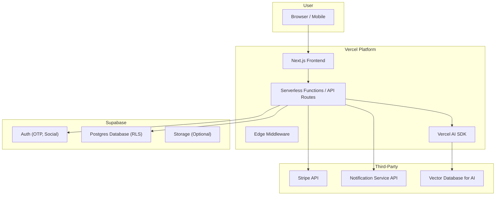

# **1. High-Level Architecture**

## Technical Summary:

This project will be a modern, serverless fullstack application built on Next.js and hosted on Vercel. User authentication and data persistence will be managed by Supabase, leveraging its Postgres database with Row-Level Security for data isolation. The frontend will be a responsive single-page application built with shadcn/ui and Tailwind CSS. AI-powered personalization for roadmap generation and journal analysis will be handled via the Vercel AI SDK. Stripe will be integrated for premium subscription payments. This architecture is designed for scalability, rapid development, and a seamless developer experience.

### **High-Level Architecture Diagram:**



## Repository Structure:

Given the tightly integrated nature of Next.js, a Monorepo approach is recommended, even for a single application. We will use a standard Next.js App Router structure. This keeps frontend and backend code (API routes) in a single, cohesive codebase, simplifying development and deployment.

```
/lattixiq
├── /app                  # Next.js App Router
│   ├── /api              # API Routes
│   ├── /(app)            # Main application routes
│   ├── /(auth)           # Authentication routes (Login)
│   └── layout.tsx
├── /components           # Shared React components (shadcn)
├── /lib                  # Helper functions, DB clients, AI SDK config
├── /styles               # Global styles
├── /tests                # TDD Test Suites
│   ├── /integration
│   └── /unit
├── /supabase             # Supabase migration files
└── package.json
```
