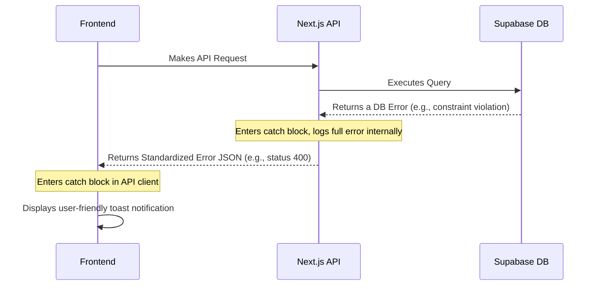

# **13. Error Handling Strategy**

This strategy defines a unified approach to error handling across the entire stack, ensuring that errors are caught, logged appropriately, and presented to the user in a clear and helpful manner.

## **Error Flow Diagram**

This diagram illustrates the flow of an error from the backend to the user.



## **Standardized API Error Format**

All errors returned from our API will follow a consistent JSON structure. This allows the frontend to handle them predictably.

```tsx
interface ApiError {
  error: {
    message: string; // User-friendly message for simple cases
    errorCode: string; // Machine-readable code for specific frontend logic
    details?: Record<string, any>; // Optional field for validation errors
  };
}
```

## **Backend Error Handling**

We will use a centralized helper function in the backend to ensure all errors are processed consistently.

- **Custom Error Class:** To better control HTTP status codes.
    
    ```tsx
    // /lib/errors.ts
    export class AppError extends Error {
      public readonly statusCode: number;
    
      constructor(message: string, statusCode: number = 500) {
        super(message);
        this.statusCode = statusCode;
      }
    }
    ```
    
- **Error Handling Logic:** API routes will use a `try/catch` block. The `catch` block will log the real error for debugging and return the standardized error format to the client.
    
    ```tsx
    // In an API Route file (/app/api/...)
    // ... inside the POST, GET, etc. function
    try {
      // ... business logic that might throw an error
    } catch (error) {
      console.error(error); // Full error is logged on the server
    
      if (error instanceof AppError) {
        return new NextResponse(
          JSON.stringify({ error: { message: error.message, errorCode: 'app_error' } }),
          { status: error.statusCode }
        );
      }
    
      // Generic server error
      return new NextResponse(
        JSON.stringify({ error: { message: 'An unexpected error occurred.', errorCode: 'internal_server_error' } }),
        { status: 500 }
      );
    }
    ```
    

## **Frontend Error Handling**

The frontend will use the `errorCode` from the API response to display appropriate user feedback, typically using a toast notification.

```tsx
// /lib/api-client.ts
import toast from 'react-hot-toast';

export async function createRoadmap(goal: string) {
  try {
    const response = await fetch('/api/roadmaps', {
      method: 'POST',
      body: JSON.stringify({ goalDescription: goal }),
      headers: { 'Content-Type': 'application/json' },
    });

    if (!response.ok) {
      // If the response is not OK, parse the error and throw it
      const errorPayload = await response.json();
      throw new Error(errorPayload.error.message || 'Failed to create roadmap.');
    }

    return await response.json();

  } catch (error) {
    // Catch the error and display a user-friendly toast notification
    toast.error(error.message || 'Something went wrong. Please try again.');
    // Return null or re-throw to be handled by the calling component
    return null; 
  }
}
```
