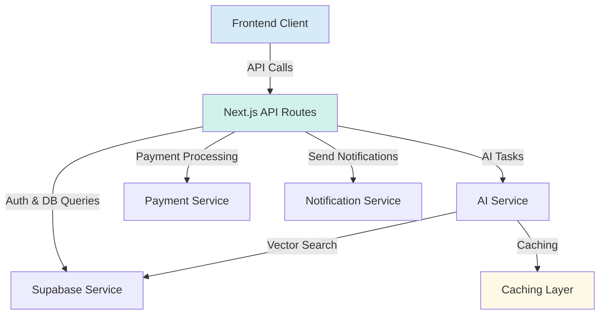

# **5. System Components**

This architecture is composed of several distinct, interacting logical components. 1

## **1. Frontend Client**

- **Responsibility:** To provide a responsive, intuitive, and "Serene Minimalist" user interface. It handles all user interactions, manages client-side state, and communicates with the backend via the API.
- **Key Interfaces:** Interacts with the user's browser. Makes HTTP requests to the Next.js API Routes.
- **Dependencies:** Next.js API Routes.
- **Technology Stack:** Next.js (App Router), React, TypeScript, shadcn/ui, Tailwind CSS, Zustand.

## **2. Next.js API Routes (Backend Logic)**

- **Responsibility:** To act as the secure backend for the application. It handles all business logic, validates user requests, orchestrates calls to other services (Supabase, AI, Stripe), and returns data to the client.
- **Key Interfaces:** Provides a RESTful API for the Frontend Client.
- **Dependencies:** Supabase Service, AI Service, Payment Service, Notification Service.
- **Technology Stack:** Next.js (API Routes), TypeScript.

## **3. Supabase Service**

- **Responsibility:** To provide core backend-as-a-service functionality. This includes secure user authentication (social & OTP), a managed PostgreSQL database with Row-Level Security, and the `pgvector` extension for semantic search.
- **Key Interfaces:** Supabase Client SDK (for client-side auth), Supabase Server-side SDK (for data access from API Routes).
- **Dependencies:** None.
- **Technology Stack:** Supabase, PostgreSQL, pgvector.

## **4. AI Service**

- **Responsibility:** To handle sophisticated AI-powered roadmap generation and analysis. This includes generating vector embeddings, executing complex semantic search with 6-factor relevance scoring, intelligent caching for performance, spaced repetition algorithms, and advanced synthesis for power users. Also handles analyzing user journal entries for sentiment and topics.
- **Key Interfaces:** Vercel AI SDK, OpenAI text-embedding-3-small model.
- **Dependencies:** A vector-enabled database (our Supabase `pgvector` instance), Caching Layer.
- **Technology Stack:** Vercel AI SDK, OpenAI embeddings, LRU caching with TTL, performance monitoring, comprehensive error handling with retry logic.

## **5. Caching Layer**

- **Responsibility:** To provide intelligent caching for AI operations to improve performance and reduce API costs. Manages separate caches for embeddings (24hr TTL) and search results (1hr TTL) with memory-based eviction policies and cache statistics.
- **Key Interfaces:** LRU Cache with TTL, cache statistics API.
- **Dependencies:** None (in-memory caching).
- **Technology Stack:** LRU-cache library, memory management with size calculation, performance monitoring.

## **6. Payment Service**

- **Responsibility:** To manage all subscription and payment-related tasks securely.
- **Key Interfaces:** Stripe API, Stripe Webhooks.
- **Dependencies:** Next.js API Routes (to handle webhook events).
- **Technology Stack:** Stripe SDK.

## **7. Notification Service**

- **Responsibility:** To send all application-related notifications (e.g., morning plan digests). This component is an abstraction layer to avoid vendor lock-in.
- **Key Interfaces:** A simple, internal `sendEmail` or `sendPush` function.
- **Dependencies:** A third-party email/push provider (e.g., Resend, Twilio).
- **Technology Stack:** To be determined (e.g., Resend SDK).

## **Component Interaction Diagram**

This diagram shows how these logical components interact to deliver the application's features.

