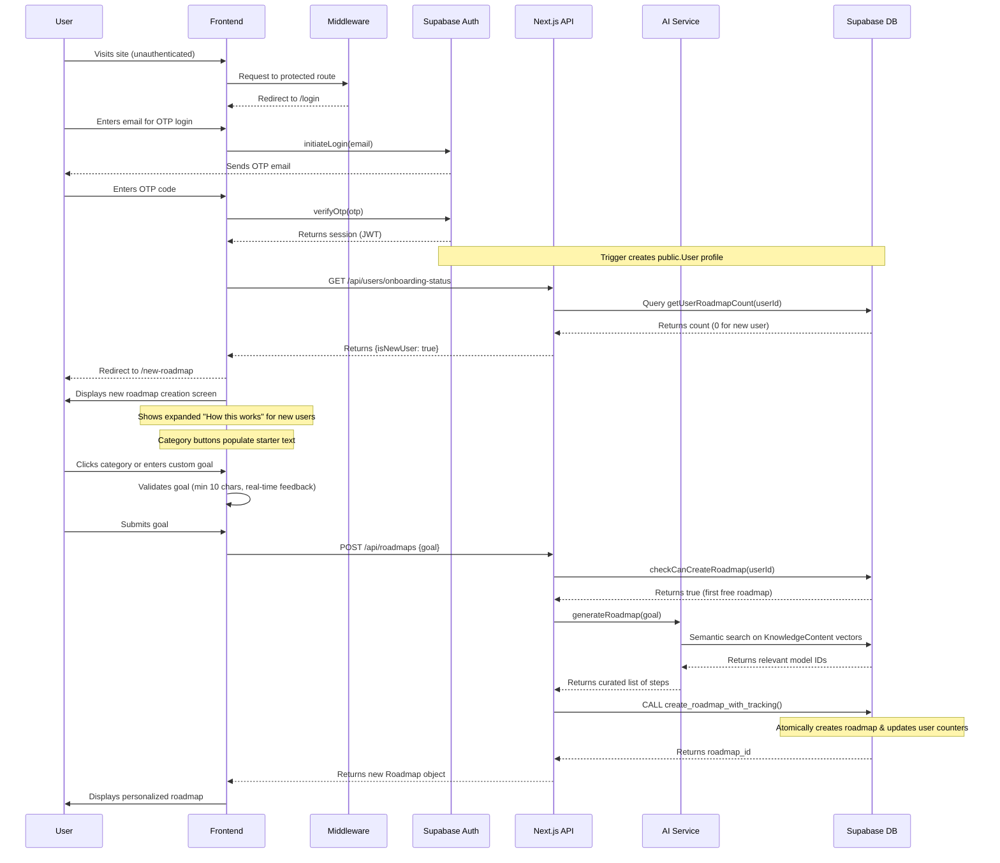
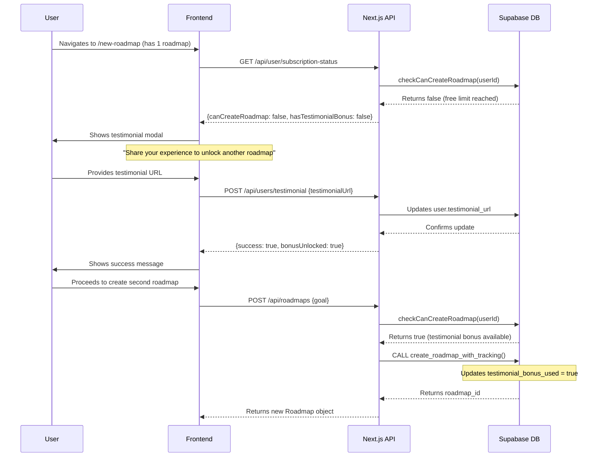
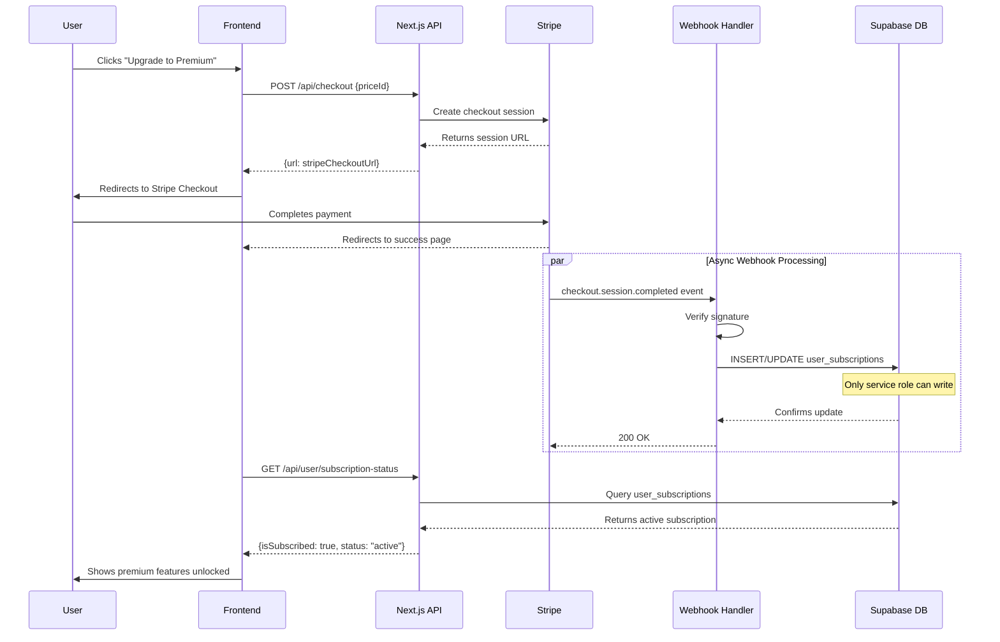
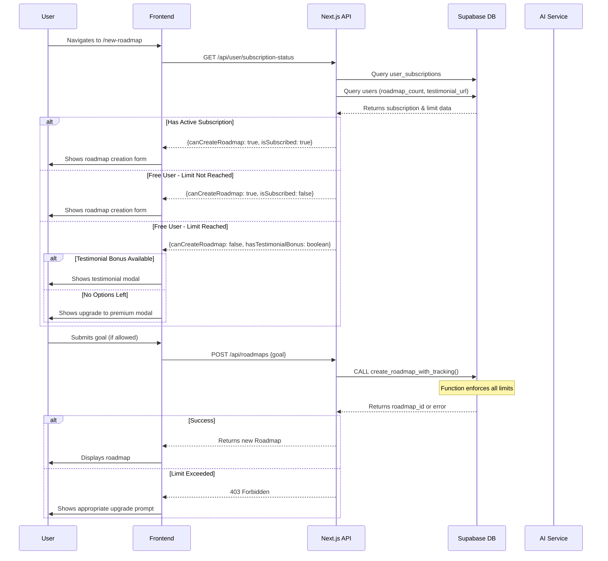
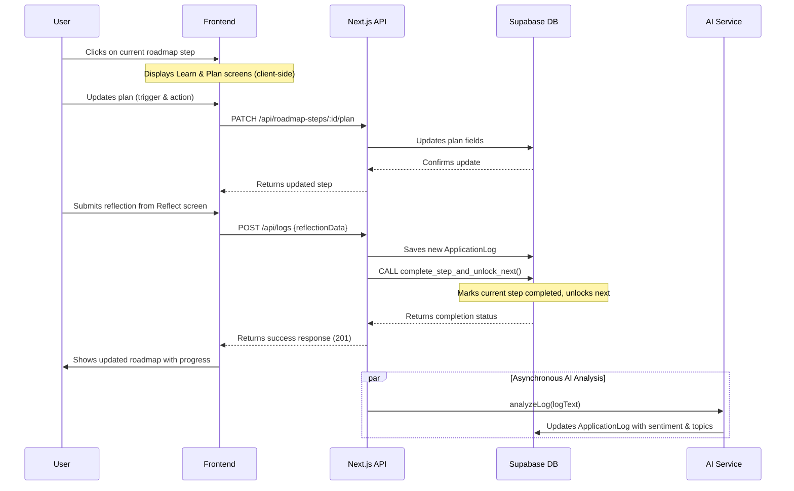
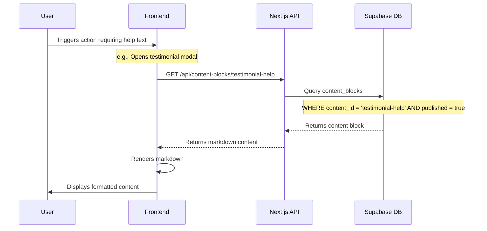
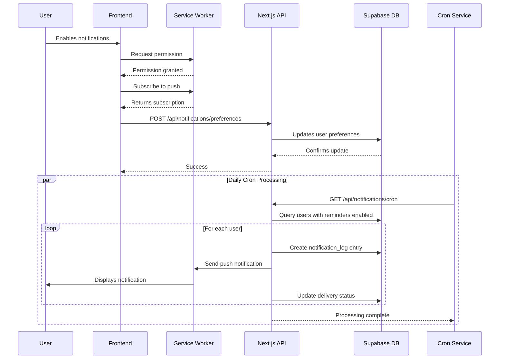
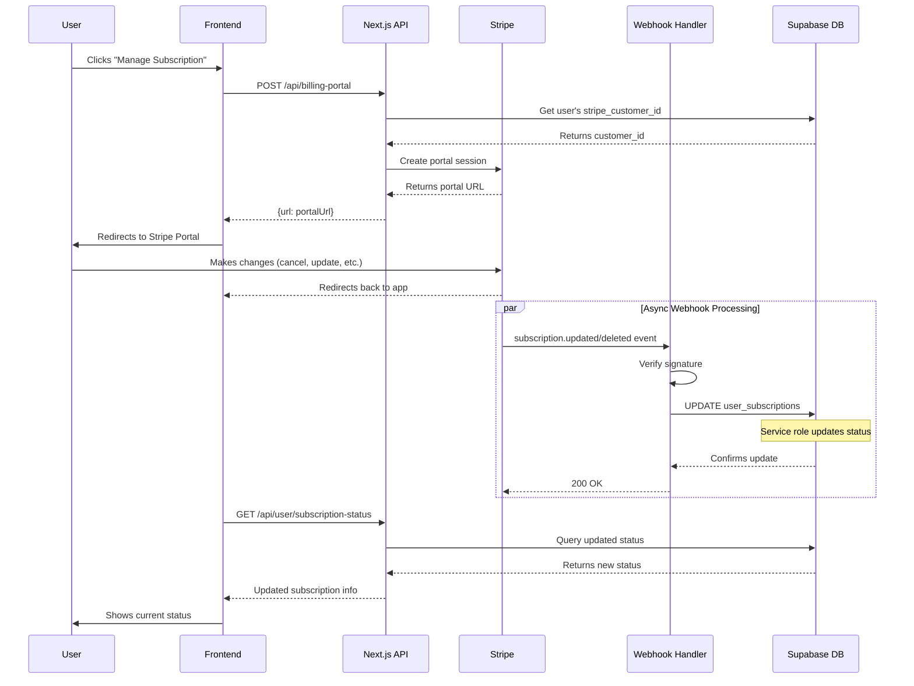

# **6. Core Workflows**

This section maps out the step-by-step interactions between our System Components for the most critical user journeys. We will use sequence diagrams to visualize these flows.

## **Workflow 1: New User Registration & First Roadmap Creation**

This workflow covers the user's journey from their first visit to seeing their personalized roadmap, which is critical for user activation.

## **Workflow 2: Free User Attempting Second Roadmap (Testimonial Flow)**

This workflow shows how free users can unlock a second roadmap by providing a testimonial.

## **Workflow 3: Subscription Purchase Flow**

This workflow details how users upgrade to premium via Stripe integration.

## **Workflow 4: Returning User Creating Additional Roadmap**

This workflow shows how the system enforces limits and handles different user types.

## **Workflow 5: Completing a Roadmap Step**

This workflow details the core engagement loop of the application: learning, planning, and reflecting to make progress.

## **Workflow 6: Content Block Loading**

This workflow shows how dynamic content is fetched for UI elements.

## **Workflow 7: Push Notification Scheduling**

This workflow details how reminders are scheduled and delivered.

## **Workflow 8: Subscription Management via Billing Portal**

This workflow shows how users manage their existing subscriptions.

## **Security Considerations in Workflows**

### **Free Limit Enforcement**

- All roadmap creation flows use `create_roadmap_with_tracking` database function
- Function atomically updates counters preventing race conditions
- No client-side limit checking - all enforcement server-side

### **Subscription Security**

- Only Stripe webhooks (service role) can modify `user_subscriptions` table
- Users can only read their own subscription status
- All subscription checks happen server-side before allowing actions

### **Data Isolation**

- RLS policies ensure users only access their own data
- No DELETE operations allowed on roadmaps/steps
- Service role required for administrative operations

### **Content Management**

- Content blocks only visible when published
- Service role required to modify content
- Client caches content to reduce database queries
