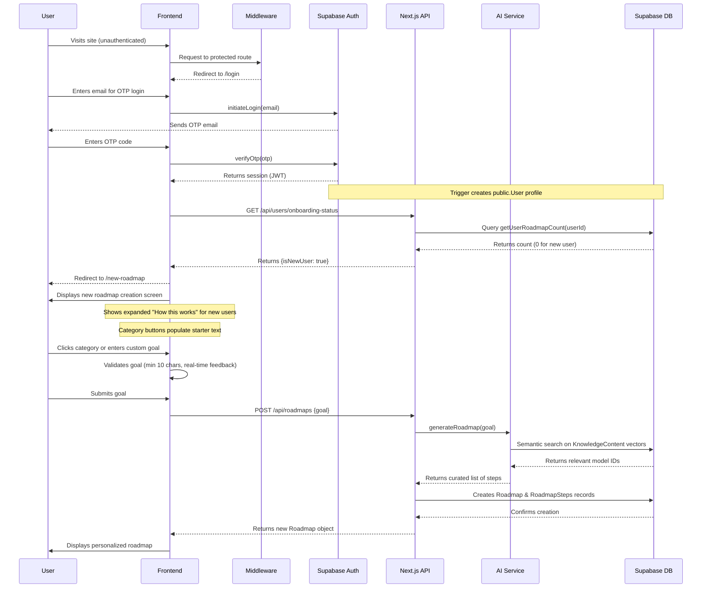
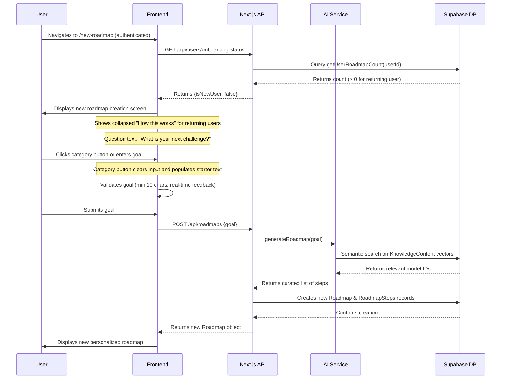
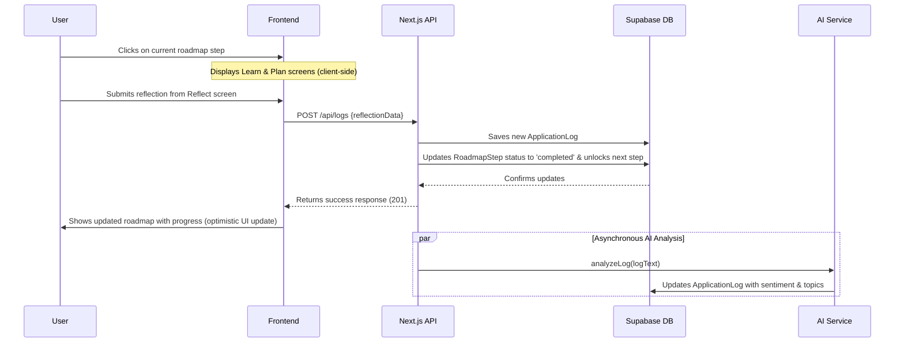

# **6. Core Workflows**

This section maps out the step-by-step interactions between our System Components for the most critical user journeys. We will use sequence diagrams to visualize these flows. 1

## **Workflow 1: New User Registration & First Roadmap Creation**

This workflow covers the user's journey from their first visit to seeing their personalized roadmap, which is critical for user activation.

## **Workflow 2: Returning User Creating New Roadmap**

This workflow shows how returning users can create additional roadmaps with a streamlined experience.

## **Workflow 3: Completing a Roadmap Step**

This workflow details the core engagement loop of the application: learning, planning, and reflecting to make progress.

