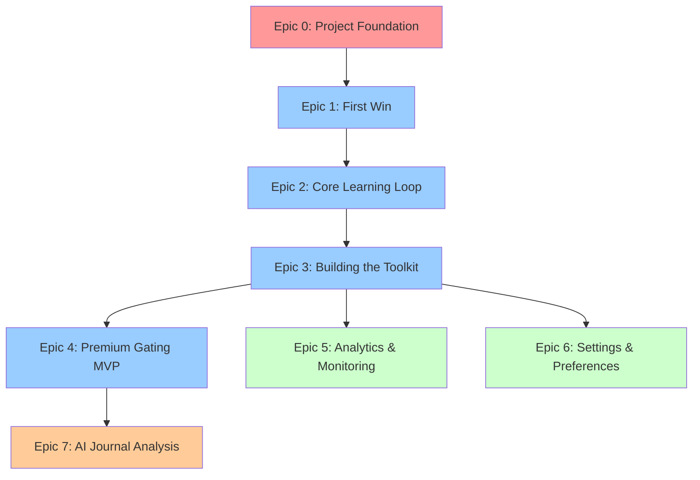

# LattixIQ Epic Overview

This document provides a high-level overview of all epics for the LattixIQ application. Epics should be completed in sequence, with Epic 0 being mandatory before any feature development begins.

## Epic Sequence and Dependencies

## Epic Summary

### Epic 0: Project Foundation & Infrastructure

**Priority:** Critical - Blocker for all other work  
**Duration:** 1 sprint (2 weeks)  
**Story Points:** 33  
**Description:** Complete setup of development environment, infrastructure, and foundational elements

**Key Deliverables:**

- Next.js project with TypeScript
- Supabase authentication and database (verified via MCP)
- CI/CD pipeline with Netlify deployment
- Testing infrastructure
- Development documentation

**Note:** Analytics and monitoring deferred to Epic 5 (post-launch)

---

### Epic 1: The First Win (Onboarding & First Roadmap)

**Priority:** High - Core MVP  
**Duration:** 2 sprints (4 weeks)  
**Story Points:** 47  
**Description:** User onboarding flow and AI-powered roadmap generation

**Key Deliverables:**

- Onboarding UI flow
- Mental models/biases database
- AI semantic matching
- Roadmap visualization
- Roadmap persistence

**Note:** Analytics tracking moved to Epic 5

---

### Epic 2: The Core Learning Loop

**Priority:** High - Core MVP  
**Duration:** 2 sprints (4 weeks)  
**Story Points:** 55  
**Description:** Three-screen learning loop (Learn, Plan, Reflect) with reminder system

**Key Deliverables:**

- Learn screen with content display
- Plan screen for intentions/missions
- Reflection journaling
- Reminder notifications
- Progress unlocking

---

### Epic 3: Building the Toolkit (Long-Term Engagement)

**Priority:** High - User retention  
**Duration:** 1.5 sprints (3 weeks)  
**Story Points:** 54  
**Description:** Central hub for returning users with progress tracking and content library

**Key Deliverables:**

- My Toolkit dashboard
- Learned models library
- Completed roadmaps history
- Application log with search
- Navigation system

---

### Epic 4: Premium Gating & Testimonials (MVP)

**Priority:** High - Core MVP  
**Duration:** 1 sprint (2 weeks)  
**Story Points:** 34  
**Description:** Basic premium gating after first roadmap completion with testimonial reward system

**Key Deliverables:**

- Stripe payment integration
- Premium gates after first roadmap
- Testimonial modal with bonus roadmap reward
- Pricing page
- Subscription management in settings

---

### Epic 5: Analytics and Monitoring (Post-Launch)

**Priority:** Medium - Post-launch optimization  
**Duration:** 1 sprint (2 weeks)  
**Story Points:** 34  
**Description:** Comprehensive analytics and monitoring implementation after MVP launch

**Key Deliverables:**

- User behavior analytics
- Error tracking (Sentry)
- Performance monitoring
- Business metrics dashboard
- Uptime monitoring

---

### Epic 6: Settings & User Preferences

**Priority:** Medium - User experience  
**Duration:** 1 sprint (2 weeks)  
**Story Points:** 29  
**Description:** User settings, preferences, and account management

**Key Deliverables:**

- Settings page with sections
- Notification preferences
- Account management
- Theme customization
- Data export options

---

### Epic 7: AI-Powered Journal Analysis & Advanced Premium

**Priority:** Low - Post-MVP  
**Duration:** 3 sprints (6 weeks)  
**Story Points:** 60  
**Description:** Advanced premium features including AI insights, pattern detection, and personalized recommendations

**Key Deliverables:**

- AI journal analysis pipeline
- Insights dashboard with visualizations
- Pattern detection algorithms
- Personalized recommendations
- Weekly insights emails
- Advanced analytics tracking

## Total Project Estimates

### MVP Scope (Epics 0-4)

- **Total Story Points:** 223 (includes basic premium gating)
- **Estimated Duration:** 7.5 sprints (15 weeks)
- **Critical Path:** Epic 0 → Epic 1 → Epic 2 → Epic 3 → Epic 4

### Post-Launch Optimization (Epics 5-6)

- **Additional Story Points:** 63
- **Additional Duration:** 2 sprints (4 weeks)

### Advanced Premium Features (Epic 7)

- **Additional Story Points:** 60
- **Additional Duration:** 3 sprints (6 weeks)

### Full Project Total (Epics 0-7)

- **Total Story Points:** 346
- **Total Duration:** 12.5 sprints (25 weeks)

## Development Recommendations

1. **Start with Epic 0** - No feature work should begin until infrastructure is complete
2. **Sequential Development** - Each epic builds on the previous one
3. **MVP First** - Complete Epics 0-3 before considering premium features
4. **User Testing** - Conduct user testing after Epic 2 to validate core loop
5. **Performance Monitoring** - Deferred to Epic 5 post-launch for real user data

## Risk Mitigation

### Technical Risks

- **AI Performance**: Test roadmap generation performance early (Epic 1)
- **Notification Delivery**: Prototype notification system during Epic 0
- **Database Scale**: Design schema with growth in mind

### Product Risks

- **User Engagement**: Validate core loop effectiveness after Epic 2
- **Premium Conversion**: Research pricing before Epic 4
- **Content Quality**: Ensure mental models data is accurate and actionable

## Success Criteria

### MVP Success (After Epic 4)

- Users can complete full journey from onboarding to reflection
- 70% of users complete first reflection
- 60% day-1 retention after first reflection
- 30% of users complete first roadmap
- 20% leave testimonials for bonus roadmap
- 15% convert to paid after first roadmap

### Advanced Premium Success (After Epic 7)

- 80% insight accuracy rating from users
- 50% recommendation acceptance rate
- 70% weekly email open rate
- 85% premium user retention (monthly)
- Premium users 3x more engaged than free users
