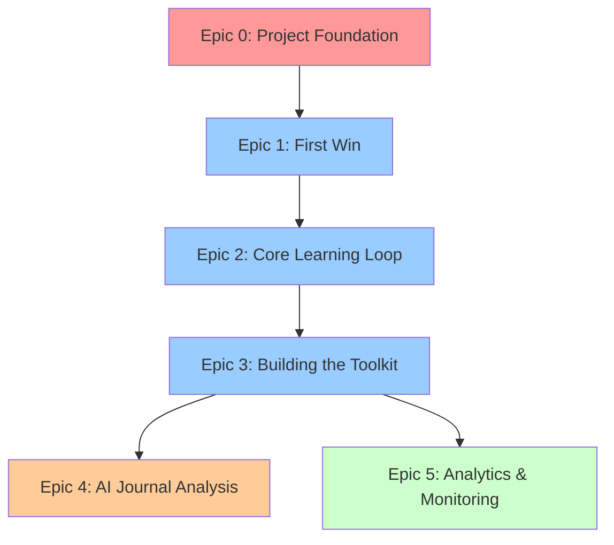

# LattixIQ Epic Overview

This document provides a high-level overview of all epics for the LattixIQ application. Epics should be completed in sequence, with Epic 0 being mandatory before any feature development begins.

## Epic Sequence and Dependencies

## Epic Summary

### Epic 0: Project Foundation & Infrastructure
**Priority:** Critical - Blocker for all other work  
**Duration:** 1 sprint (2 weeks)  
**Story Points:** 33  
**Description:** Complete setup of development environment, infrastructure, and foundational elements

**Key Deliverables:**
- Next.js project with TypeScript
- Supabase authentication and database (verified via MCP)
- CI/CD pipeline with Netlify deployment
- Testing infrastructure
- Development documentation

**Note:** Analytics and monitoring deferred to Epic 5 (post-launch)

---

### Epic 1: The First Win (Onboarding & First Roadmap)
**Priority:** High - Core MVP  
**Duration:** 2 sprints (4 weeks)  
**Story Points:** 47  
**Description:** User onboarding flow and AI-powered roadmap generation

**Key Deliverables:**
- Onboarding UI flow
- Mental models/biases database
- AI semantic matching
- Roadmap visualization
- Roadmap persistence

**Note:** Analytics tracking moved to Epic 5

---

### Epic 2: The Core Learning Loop
**Priority:** High - Core MVP  
**Duration:** 2 sprints (4 weeks)  
**Story Points:** 55  
**Description:** Three-screen learning loop (Learn, Plan, Reflect) with reminder system

**Key Deliverables:**
- Learn screen with content display
- Plan screen for intentions/missions
- Reflection journaling
- Reminder notifications
- Progress unlocking

---

### Epic 3: Building the Toolkit (Long-Term Engagement)
**Priority:** High - User retention  
**Duration:** 1.5 sprints (3 weeks)  
**Story Points:** 54  
**Description:** Central hub for returning users with progress tracking and content library

**Key Deliverables:**
- My Toolkit dashboard
- Learned models library
- Completed roadmaps history
- Application log with search
- Navigation system

---

### Epic 4: AI-Powered Journal Analysis & Personalization (Premium)
**Priority:** Low - Post-MVP  
**Duration:** 2 sprints (4 weeks)  
**Story Points:** 71  
**Description:** Premium features including AI insights, pattern detection, and personalized recommendations

**Key Deliverables:**
- Stripe payment integration
- AI journal analysis
- Insights dashboard
- Pattern detection
- Personalized recommendations

---

### Epic 5: Analytics and Monitoring (Post-Launch)
**Priority:** Medium - Post-launch optimization  
**Duration:** 1 sprint (2 weeks)  
**Story Points:** 34  
**Description:** Comprehensive analytics and monitoring implementation after MVP launch

**Key Deliverables:**
- User behavior analytics
- Error tracking (Sentry)
- Performance monitoring
- Business metrics dashboard
- Uptime monitoring

## Total Project Estimates

### MVP Scope (Epics 0-3)
- **Total Story Points:** 189 (adjusted for Epic 0 and Epic 1 changes)
- **Estimated Duration:** 6.5 sprints (13 weeks)
- **Critical Path:** Epic 0 → Epic 1 → Epic 2 → Epic 3

### Premium Features (Epic 4)
- **Additional Story Points:** 71
- **Additional Duration:** 2 sprints (4 weeks)

### Post-Launch Optimization (Epic 5)
- **Additional Story Points:** 34
- **Additional Duration:** 1 sprint (2 weeks)
- **Total Project (Epics 0-5):** 294 story points

## Development Recommendations

1. **Start with Epic 0** - No feature work should begin until infrastructure is complete
2. **Sequential Development** - Each epic builds on the previous one
3. **MVP First** - Complete Epics 0-3 before considering premium features
4. **User Testing** - Conduct user testing after Epic 2 to validate core loop
5. **Performance Monitoring** - Deferred to Epic 5 post-launch for real user data

## Risk Mitigation

### Technical Risks
- **AI Performance**: Test roadmap generation performance early (Epic 1)
- **Notification Delivery**: Prototype notification system during Epic 0
- **Database Scale**: Design schema with growth in mind

### Product Risks
- **User Engagement**: Validate core loop effectiveness after Epic 2
- **Premium Conversion**: Research pricing before Epic 4
- **Content Quality**: Ensure mental models data is accurate and actionable

## Success Criteria

### MVP Success (After Epic 3)
- Users can complete full journey from onboarding to reflection
- 70% of users complete first reflection
- 60% day-1 retention after first reflection
- 80% of users rate experience 4+ stars

### Premium Success (After Epic 4)
- 20% free-to-paid conversion rate
- 90% monthly retention for premium users
- Premium users 2x more engaged than free users