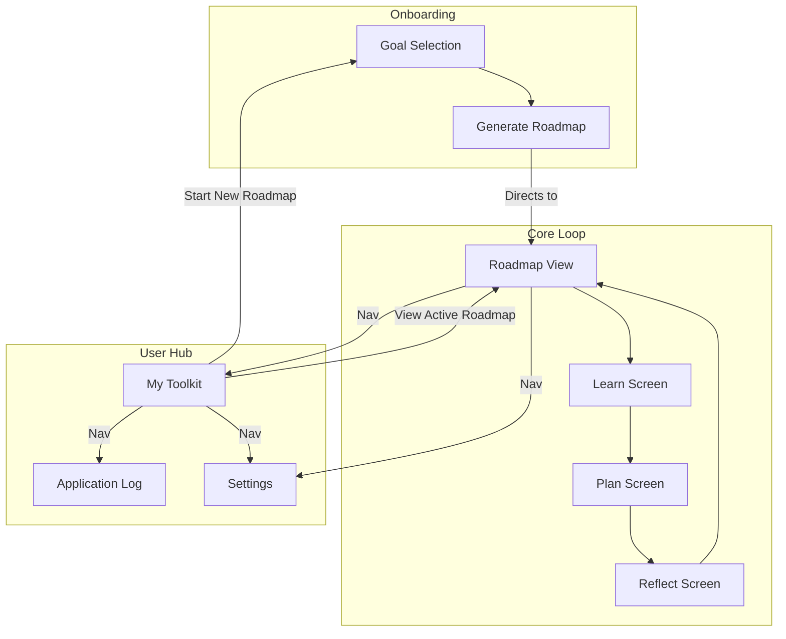
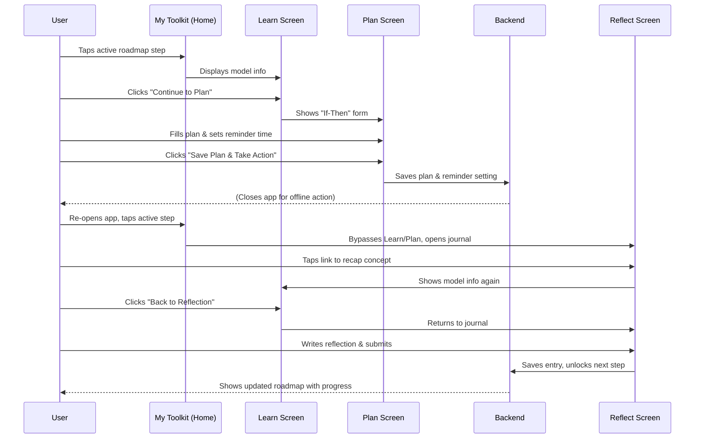

# **UI/UX Specification for "**LattixIQ**"**

## **1. Overall UX Goals & Principles**

- **Target User Persona:** "The Stagnant Achiever," who needs a structured, supportive, and non-overwhelming environment.
- **Usability Goals:**
    - **High Clarity:** The user should never feel confused about what to do next.
    - **Low Friction:** The core loop of "Learn, Plan, Act, Reflect" must feel effortless and rewarding.
    - **Fosters Calm:** The interface should reduce anxiety, not add to it.
- **Core Design Principles:**
    1. **Intentional Simplicity:** Every element on the screen must serve a purpose. We will use generous white space, a limited color palette, and avoid any visual clutter to create a "Serene Minimalist" aesthetic.
    2. **Celebrate Every Step:** The feeling of being "Accomplished" is paramount. Completing a reflection and unlocking a new model will be met with subtle, elegant, and satisfying feedback (e.g., gentle animations, a visually pleasing update to the roadmap).
    3. **Supportive Guidance:** The app's tone and interface will be "Calming and Supportive." Language will be encouraging, and interactions will feel gentle, never demanding or urgent.

---

## **2. Information Architecture (IA)**

With our foundational principles in place, we will now define the app's structure—its **Information Architecture (IA)**. The architecture is designed to provide a clear path for new users while establishing a consistent, supportive hub for returning users.

The core principle of our IA is this: After creating a goal, the user is immediately shown their new, personalized roadmap. For all subsequent sessions, the **"My Toolkit"** screen serves as the permanent home and central hub, from which they can resume their journey or start a new one.

### **Screen & Feature List**

- **Onboarding / Goal Selection:** A flow to capture a user's primary growth goal, which powers the AI roadmap generation.
- **Roadmap View:** The detailed, visual screen showing the user's current learning path. This is the first thing a user sees after their roadmap is created.
- **My Toolkit (Primary Home/Hub):** The main landing screen for all returning users. It displays their active roadmap and provides access to all their learned tools and completed journeys.
- **Learn Screen:** A focused, dedicated view for learning a single mental model or cognitive bias.
- **Plan Screen:** The structured form for creating an "Implementation Intention" or "Spotting Mission."
- **Reflect Screen:** The journal form where a user logs their application of a model to unlock the next step.
- **Application Log:** A simple, clean list where users can review all their past reflections.
- **Settings:** The screen for account management and notification preferences.

### **User Journey Logic**

This logic ensures a smooth and rewarding progression through the app:

1. **New User:** The journey begins with `Onboarding / Goal Selection`. After the roadmap is generated, the user is taken **directly to the `Roadmap View`** to see their new path.
2. **Returning User (Starting a New Roadmap):** From the `My Toolkit` hub, the user taps "Start a New Roadmap." This initiates the `Goal Selection` flow. Once the new roadmap is generated, they are taken **directly to the new `Roadmap View`**.
3. **Returning User (With an Active Roadmap):** The user lands on their `My Toolkit` hub, which prominently displays their active roadmap and provides a clear link to resume their journey on the `Roadmap View`.

### **Site Map Diagram**

This diagram illustrates the revised, more direct user flow. Note that upon roadmap generation (`B`), the user is now taken immediately to the `Roadmap View` (`C`).



## **3. User Flows**

This section details the path a user takes through the app's screens to complete specific goals. The flows are designed to be intuitive, supportive, and to minimize friction, guiding the user seamlessly from knowledge acquisition to real-world application.

### **Flow: Goal Selection & Onboarding**

- **User Goal:** To define a personal growth goal and receive a relevant, AI-curated learning path.
- **Entry Point:** A new user after login, or a returning user tapping "Start a New Roadmap" from their Toolkit.
- **Success Criteria:** The user provides a goal and feels confident and excited about the roadmap that is generated for them.

### **Interaction Details:**

1. **Guidance Prompt:** The screen presents a clear, open-ended question like "What is your single biggest challenge right now?" to encourage a thoughtful response.
2. **Contextual Explainer:**
    - For **new users**, an expandable box detailing the app's value proposition ("How this works") appears open by default. It explains that the user's input will be used to generate a custom roadmap of mental models designed to solve their specific problem. This sets expectations and communicates the app's unique selling point.
    - For **returning users**, this box is collapsed by default to keep the interface clean, but they can still expand it for a reminder.
3. **Input Field:** A multi-line text area provides ample space. Placeholder text offers examples of well-formed goals (e.g., "I want to stop procrastinating," "I want to think more clearly about business strategy").
4. **Roadmap Generation:** Upon tapping `[ Create My Roadmap ]`, the app uses the user's text input to perform semantic matching and generate the 5-7 step roadmap. The user is then navigated to their `My Toolkit` hub, where the new active roadmap is displayed.

### **Flow: Completing a Roadmap Step**

- **User Goal:** To learn a new mental model, create a plan to apply it, reflect on the experience, and make tangible progress on their active roadmap.
- **Entry Point:** The user taps on the current, unlocked step in their "Roadmap View" screen.
- **Success Criteria:** The user successfully submits their reflection, feels a sense of accomplishment, and sees the next step on their roadmap unlock.

### **The Step-by-Step Journey:**

1. **Learning the Concept:** The user is taken to the `Learn Screen`, which provides a concise, actionable summary of the current mental model or cognitive bias.
2. **Creating the Plan:** After reading, the user proceeds to the `Plan Screen`. Here, they create a concrete "If-Then" plan or "Spotting Mission". On this same screen, they can set their global preference for a daily reminder, including the specific time. They save the entire plan and reminder setting with a single action.
3. **Taking Offline Action:** The user closes the app to apply their plan in the real world. If enabled, the Notification Service will send them a reminder at their chosen time, using their own words to prompt them.
4. **Returning to Reflect:** When the user re-opens the app and navigates to the active step, the system's state persistence logic recognizes a plan has been saved. It takes the user directly to the `Reflect Screen`.
5. **Recapping and Reflecting:** If the user needs to refresh their memory on the concept while on the `Reflect Screen`, they can tap a link to go back to the `Learn Screen`. The `Learn Screen` will recognize they have an active plan and its main button will now navigate them back to the `Reflect Screen`. Once ready, the user writes their journal entry, rates the model's effectiveness, and submits to complete the step and unlock the next one on their roadmap.

### **Sequence Diagram:**



### **Flow: Collecting User Testimonials**

- **User Goal:** (From the app's perspective) To capture positive user testimonials at moments of high satisfaction.
- **Trigger Points:** A conditional "Testimonial Card" will appear at the top of the "My Toolkit" screen based on specific success milestones.

### **Interaction Details:**

1. **Trigger 1: First Roadmap Completion.** When a user finishes their first roadmap, the card appears with a congratulatory message ("Congratulations on finishing your first roadmap!"). If the user dismisses it, it will not appear again until the next trigger is met.
2. **Trigger 2: Sustained Success.** If the user dismissed the first request and has since completed at least three consecutive roadmaps with high self-rated feedback (4 or 5 stars), the card will reappear with an adapted message ("Wow, you've completed several roadmaps with great results!"). If dismissed a second time, it will not be shown again.

### **Edge Cases & State Management**

- **Navigation:** The user can freely navigate back from the `Plan` or `Reflect` screens to the `Learn` screen to review the concept without losing their work-in-progress.
- **State Persistence:** If the user creates a plan but closes the app before reflecting, their plan is saved. When they return, tapping the roadmap step will take them directly to the `Reflect` screen.
- **Input Validation:** The `Reflect` screen will require a minimum amount of text to be entered before the "Submit" button is enabled to ensure a thoughtful entry.

## **4. Wireframes & Mockups**

This section provides low-fidelity wireframes for the core screens of the application. These layouts are designed to align with our established principles of being **Calming, Supportive, and Serene Minimalist**. The focus is on clarity and a single, primary action for each screen.

### **Screen 1: Roadmap**

This is the user's main dashboard, showing their active journey.

```
.-----------------------------------------------------.
| [Growth Roadmap]              [?] Help              |
|-----------------------------------------------------|
|                                                     |
|  Your Roadmap: Stop Procrastinating                 |
|                                                     |
|  (✓) Step 1: Activation Energy                      |
|      |                                              |
|  /---\                                              |
|  | 2 |  Step 2: Inversion (Current Step)            |
|  \---/                                              |
|      |                                              |
|  ( 🔒 ) Step 3: Deprival-Superreaction              |
|      |                                              |
|  ( 🔒 ) Step 4: ...                                 |
|                                                     |
|                                                     |
|                                                     |
|-----------------------------------------------------|
| (My Toolkit)                (Settings)              |
'-----------------------------------------------------'
```

### **Screen 2: Learn Screen**

This screen is focused purely on learning the concept without distraction. The "Continue" button on this screen will now be dynamic. Its text and action will change based on whether the user has already created a plan for this step.

```
.-----------------------------------------------------.
| < Back to Roadmap                                   |
|-----------------------------------------------------|
|                                                     |
|  Mental Model: Activation Energy                    |
|  -------------------------------                    |
|                                                     |
|  Activation Energy is the minimum energy required   |
|  to initiate a process. For habits, this means      |
|  the key is to make the first action as effortless  |
|  as possible to overcome the initial resistance.    |
|                                                     |
|  (More descriptive text here...)                    |
|                                                     |
|                                                     |
|       [ Continue to Plan ] or [ Back to Reflection ]|
'-----------------------------------------------------'
```

- **Conditional Logic for Button:**
    - **If** no plan exists for this step, the button reads `[ Continue to Plan ]` and navigates to the Plan Screen.
    - **If** a plan *does* exist (meaning the user came from the Reflect screen), the button reads `[ Back to Reflection ]` and navigates them back to the Reflect Screen.

### **Screen 3: Plan Screen**

This screen guides the user to create their actionable "If-Then" plan.

```
.-----------------------------------------------------.
| < Back to Learn                                     |
|-----------------------------------------------------|
|                                                     |
|  Create Your Plan                                   |
|  ----------------                                   |
|                                                     |
|  Use "Activation Energy" to plan your first step.   |
|                                                     |
|  IF:                                                |
|  +-----------------------------------------------+  |
|  | It's 9 AM and I need to start my report...    |  |
|  +-----------------------------------------------+  |
|                                                     |
|  THEN I WILL:                                       |
|  +-----------------------------------------------+  |
|  | Open the doc and write for just 5 minutes.    |  |
|  +-----------------------------------------------+  |
|                                                     |
|  REMINDER                                           |
|  +-----------------------------------------------+  |
|  | Daily Reminder                [ On (o-)]      |  |
|  | Remind me at:  [ 9:00 AM  v]                  |  |
|  +-----------------------------------------------+  |
|                                                     |
|               [ Save Plan & Take Action ]           |
'-----------------------------------------------------'
```

**How will the user know what to write? (Guidance & Help)**

A blank form can be intimidating. We will guide the user with a multi-layered approach to ensure they create effective plans:

- **Contextual Prompts:** The screen will have a single line of dynamic text that changes based on the mental model they're learning.
    - *For "Activation Energy":* "Your 'IF' should be the moment you usually hesitate. Your 'THEN' should be an action so small it feels easy."
    - *For "Inversion":* "Your 'IF' should be the moment before a big decision. Your 'THEN' should be the action of listing potential negative outcomes first."
- **Smart Placeholder Text:** The input fields themselves will offer clues.
    - `IF:` will have a placeholder saying, *e.g., "a specific time, place, or feeling."*
    - `THEN I WILL:` will have a placeholder saying, *e.g., "a tiny, physical first step."*
- **Goal-Relevant Examples:** The "(See examples)" link will be a key feature. When clicked, it will show 2-3 high-quality examples that are relevant to the user's overall roadmap goal. If their goal is "Be More Active," the examples for "Activation Energy" will be about fitness, not work projects.

**Will there be validation on the typed-in phrases (e.g., with AI)?**

This is a crucial question of balance between guidance and friction.

- **For V1 (No AI validation):** An AI judging a user's personal plan can feel critical and creates a "computer says no" experience, which goes against our "Calming and Supportive" principle. It can also be inaccurate and frustrating. Instead, the real validation happens in the **"Reflect" step**. If the user's plan was ineffective, their own reflection and low star rating will teach them that. They learn by doing and self-assessing, which is more powerful.
- **For V2 (A Future Enhancement):** We can introduce a non-blocking, **AI-powered "Coach."** After the user saves their plan, a small, optional suggestion could appear. For example, if a user writes, "IF I feel motivated...", the AI Coach could gently suggest: *"That's a good start! For a more powerful trigger, try linking your plan to a specific time or event, like 'IF I pour my morning coffee...'"* This makes the AI a helpful guide, not a gatekeeper.

### **Screen 4: Reflect Screen (Application Log)**

This is the final, crucial step for logging the user's experience.

```
.-----------------------------------------------------.
| < Back to Learn                                     |
|-----------------------------------------------------|
|                                                     |
|  Log Your Application                               |
|  --------------------                               |
|                                                     |
|  How did your plan to "write for just 5 minutes" go?|
|                                                     |
|  Describe what happened:                            |
|  +-----------------------------------------------+  |
|  | I actually felt motivated and ended up        |  |
|  | writing for 15 minutes. It was easy once...   |  |
|  +-----------------------------------------------+  |
|                                                     |
|  How effective was this model for you?              |
|  [ ★ ★ ★ ★ ☆ ]                                      |
|                                                     |
|          [ Complete & Unlock Next Step ]            |
'-----------------------------------------------------'
```

### Screen 5: **Settings Page Screen**

**Wireframe: Settings Screen**

This wireframe uses the "List Item" and "Toggle Switch" components.

```
.-----------------------------------------------------.
| [Settings]                                          |
|-----------------------------------------------------|
|                                                     |
|  ACCOUNT                                            |
|  +-----------------------------------------------+  |
|  | Email:        the.stagnant.achiever@email.com |  |
|  +-----------------------------------------------+  |
|  | Plan:                             Free Tier > |  |
|  +-----------------------------------------------+  |
|                                                     |
|  NOTIFICATIONS                                      |
|  +-----------------------------------------------+  |
|  | Daily Reminder                [ On (o-)]      |  |
|  | Reminder Time: [ 9:00 AM  v]                  |  |
|  +-----------------------------------------------+  |
|                                                     |
|  [ Logout ]                                         |
|                                                     |
|-----------------------------------------------------|
| (My Toolkit)                (Settings)              |
'-----------------------------------------------------'
```

**How will the app handle notifications?**

This is a critical piece of closing the loop. A complex, context-aware system (knowing *when* the user is at the office, for example) is difficult for a simple web app. Therefore, we will use a streamlined, user-controlled approach for V1.

After the user saves their plan, the app will ask: **"How would you like to be reminded?"**

1. **Remind me at a specific time:** The user can pick a time and day (e.g., every weekday at 9:00 AM). The app will send a notification at that exact time. This is perfect for time-cued habits.
2. **Add to my morning plan:** The app sends a single, consolidated email or push notification each morning (e.g., at 8:00 AM) with the user's active "If-Then" plan for the day. This is a great default to avoid notification fatigue.
3. **No reminder needed:** The user can opt out if the planning exercise itself is all they need.

The notification itself will be powerful because it's in the user's own words: *"Remember your plan: IF I finish my lunch break, THEN I WILL open my report and write one paragraph."*

### **Screen 6: Login Flow**

The login process will be a two-state screen to handle the passwordless email flow.

**State 1: Initial Login**

This is the first screen a new or logged-out user will see.

```
.-----------------------------------------------------.
|                                                     |
|                 [ App Logo / Name ]                 |
|            Your roadmap to a clearer mind.          |
|                                                     |
|                                                     |
|           +-------------------------------+         |
|           |  G  |  Continue with Google   |         |
|           +-------------------------------+         |
|                                                     |
|           +-------------------------------+         |
|           |    |  Continue with Apple    |         |
|           +-------------------------------+         |
|                                                     |
|                ----------- or -----------           |
|                                                     |
|  Email Address                                      |
|  +-----------------------------------------------+  |
|  | your@email.com                                |  |
|  +-----------------------------------------------+  |
|                                                     |
|                [ Continue with Email ]              |
|                                                     |
'-----------------------------------------------------'
```

**State 2: OTP (One-Time Password) Entry**

After a user enters their email and clicks "Continue," the input area will smoothly transition to this state.

```
.-----------------------------------------------------.
|                                                     |
|                 [ App Logo / Name ]                 |
|                                                     |
|   We've sent a 6-digit code to your email.          |
|   Enter it below to log in.                         |
|   (Change email)                                    |
|                                                     |
|                                                     |
|      [ 1 ] [ 2 ] [ 3 ]   [ 4 ] [ 5 ] [ 6 ]          |
|                                                     |
|                                                     |
|                     (Resend code)                   |
|                                                     |
|                       [ Log In ]                    |
|                                                     |
|                                                     |
|                                                     |
'-----------------------------------------------------'
```

### **Screen 7: "My Toolkit" (Home Screen)**

This is the user's permanent home screen. It conditionally displays their active roadmap or prompts them to start a new one.

```
.-------------------------------------------------------.
| [LattixIQ]                      [?] Help              |
|-------------------------------------------------------|
|                                                       |
|  Welcome back, Achiever!                              |
|                                                       |
|  .-------------------------------------------------.  |
|  |  ACTIVE ROADMAP                           [ -> ]|  |
|  |  Stop Procrastinating                           |  |
|  |  ---------------------------------------        |  |
|  |  Current Step: Inversion                        |  |
|  '-------------------------------------------------'  |
|  (This card is only shown if a roadmap is active)     |
|                                                       |
|  MY LEARNINGS                                         |
|  +-------------------------------------------------+  |
|  | My Learned Models (5)                         > |  |
|  +-------------------------------------------------+  |
|  | My Completed Roadmaps (1)                     > |  |
|  +-------------------------------------------------+  |
|  | Application Log                               > |  |
|  +-------------------------------------------------+  |
|                                                       |
|                                                       |
|-------------------------------------------------------|
| (My Toolkit)                  (Settings)              |
'-------------------------------------------------------'
```

**With Conditional Testimonial Card**

This wireframe shows how the testimonial-asking card will appear at the top of the "My Toolkit" screen. The content within the card will change based on the trigger. If the user already started a new roadmap but the testimonial card still needs to be displayed, then the testimonial card will appear before the Active Roadmap card.

```
.-------------------------------------------------------.
| [My Toolkit]                                          |
|-------------------------------------------------------|
| .---------------------------------------------------. |
| | Congratulations on finishing your first roadmap!  | |
| | We'd love to hear about your experience. [ X ]    | |
| |                                                   | |
| |  +-------------------------------------------+    | |
| |  |                                           |    | |
| |  |         Embedded Senja Testimonial        |    | |
| |  |            Collector Widget               |    | |
| |  |                                           |    | |
| |  +-------------------------------------------+    | |
| '---------------------------------------------------' |
|                                                       |
|  MY TOOLKIT                                           |
|  +-----------------------------------------------+    |
|  | Start a New Roadmap                           >    |
|  +-----------------------------------------------+    |
|  | My Learned Models (5)                         >    |
|  +-----------------------------------------------+    |
|  | My Completed Roadmaps (1)                     >    |
|  +-----------------------------------------------+    |
|                                                       |
|-------------------------------------------------------|
| (My Toolkit)                (Settings)                |
'-------------------------------------------------------'
```

**Testimonial-asking Card Content Variants:**

- **Trigger 1 (First Win) Text:** "Congratulations on finishing your first roadmap! That's a huge achievement. If you have a moment, we'd love to hear about your experience."
- **Trigger 2 (Sustained Success) Text:** "Wow, you've completed several roadmaps with great results! We're so glad you're finding this valuable. If you're willing, we'd love for you to share your story."

### **Screen 8: Onboarding / Goal Selection Screen**

This is the first screen for a new user, and the screen a returning user sees when starting a new roadmap. Its goal is to capture a high-quality problem or goal statement to power the AI-driven roadmap generation.

**State 1: New User (Explainer Expanded)**

```
.-----------------------------------------------------.
| [LattixIQ]                                          |
|-----------------------------------------------------|
|                                                     |
|  What is your single biggest challenge right now?   |
|                                                     |
|  .-----------------------------------------------.  |
|  | [v] How this works                            |  |
|  |                                               |  |
|  | We'll use your goal to build a personalized   |  |
|  | roadmap of powerful mental models. Instead of |  |
|  | just reading, you'll learn proven frameworks  |  |
|  | to solve your exact problem.                  |  |
|  '-----------------------------------------------'  |
|                                                     |
|  Describe your goal or problem:                     |
|  +-----------------------------------------------+  |
|  | e.g., "I want to stop procrastinating on my   |  |
|  | big projects at work."                        |  |
|  +-----------------------------------------------+  |
|                                                     |
|                [ Create My Roadmap ]                |
'-----------------------------------------------------'
```

**State 2: Returning User (Explainer Collapsed)**

```
.-----------------------------------------------------.
| [LattixIQ]                                          |
|-----------------------------------------------------|
|                                                     |
|  What is your next challenge?                       |
|                                                     |
|  .-----------------------------------------------.  |
|  | [>] How this works                            |  |
|  '-----------------------------------------------'  |
|                                                     |
|  Describe your goal or problem:                     |
|  +-----------------------------------------------+  |
|  | e.g., "I need to make better decisions under  |  |
|  | pressure."                                    |  |
|  +-----------------------------------------------+  |
|                                                     |
|                [ Create My Roadmap ]                |
'-----------------------------------------------------'
```

## **5. Component Library / Design System**

- **Design System Approach:** For the first version of our product, we will establish a **Core Component Library**. This is a focused collection of essential, reusable UI elements that will define our "Serene Minimalist" aesthetic. This library will ensure a consistent user experience and will serve as the foundation for a more comprehensive design system in the future. 1
- **Core Components:** Based on our wireframes, we will need to design the following foundational components:
    1. **Button**
        - **Purpose:** The primary element for user actions.
        - **Variants:**
            - `Primary`: Used for the main call-to-action on a screen (e.g., "[ Complete & Unlock Next Step ]").
            - `Secondary`: Used for less important actions (e.g., "See examples").
            - `Text/Link`: Used for navigation (e.g., "< Back to Roadmap").
        - **States:** `Default`, `Hover`, `Pressed`, `Disabled`.
    2. **Input Field**
        - **Purpose:** To capture user text for the Plan and Reflect screens.
        - **Variants:** `Single-line` (for the "If-Then" plan), `Multi-line Text Area` (for reflections).
        - **States:** `Default`, `Focused`, `Filled`, `Error`.
    3. **Roadmap Step**
        - **Purpose:** The visual indicator for each step in a user's journey.
        - **Variants:** None.
        - **States:** `Completed` (e.g., shows a checkmark ✓), `Current` (highlighted, actionable), `Locked` (dimmed, shows a 🔒 icon).
    4. **Content Card**
        - **Purpose:** A container for grouping related content, such as on the Learn and Reflect screens.
        - **Style:** Will have soft, rounded corners and a very subtle border or shadow to create a gentle sense of depth, aligning with our "Serene" aesthetic.
    5. **Bottom Navigation**
        - **Purpose:** Persistent, app-level navigation.
        - **Elements:** Will contain icon-based links to "My Toolkit" and "Settings."
        - **Style:** Minimalist and unobtrusive.
    6. **List Item:**
        - For displaying rows of information. It will have a `simple` variant (for email) and a `navigational` variant that the user can tap (for notification settings).
    7. **Toggle Switch:**
        - A simple on/off switch, primarily for the notification settings.
    8. **Social Login Button:**
        - A full-width button with a logo and clear text (e.g., "Continue with Google").

## **6. Responsiveness Strategy**

- **Approach:** The application will be designed mobile-first. The core experience will be optimized for a single-column view on a mobile device.
- **Breakpoints:**
    - **Mobile (up to 768px):** The standard single-column view as shown in the wireframes.
    - **Tablet/Desktop (769px and up):** The layout will expand, increasing white space. On screens like "My Toolkit," we may introduce a two-column layout to make better use of the space.

---

## About the menu:

For our V1, the **Bottom Navigation** bar will serve as the primary "menu." This is a common and highly effective pattern in modern mobile apps that keeps the main destinations ("My Toolkit," "Settings") always accessible without needing to hide them in a traditional "hamburger" menu. This keeps the interface cleaner and more aligned with our simplicity principle.
