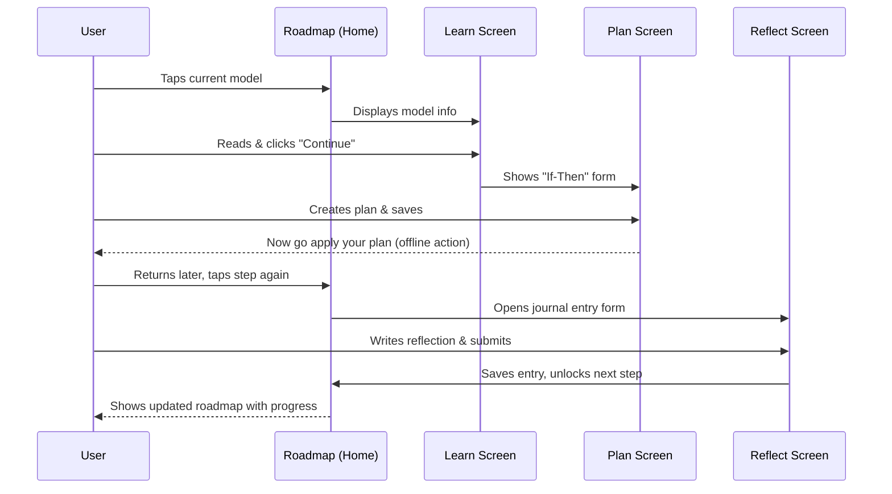

# UI/UX Specification for "LattixIQ"

## **1. Overall UX Goals & Principles**

- **Target User Persona:** "The Stagnant Achiever," who needs a structured, supportive, and non-overwhelming environment.
- **Usability Goals:**
    - **High Clarity:** The user should never feel confused about what to do next.
    - **Low Friction:** The core loop of "Learn, Plan, Act, Reflect" must feel effortless and rewarding.
    - **Fosters Calm:** The interface should reduce anxiety, not add to it.
- **Core Design Principles:**
    1. **Intentional Simplicity:** Every element on the screen must serve a purpose. We will use generous white space, a limited color palette, and avoid any visual clutter to create a "Serene Minimalist" aesthetic.
    2. **Celebrate Every Step:** The feeling of being "Accomplished" is paramount. Completing a reflection and unlocking a new model will be met with subtle, elegant, and satisfying feedback (e.g., gentle animations, a visually pleasing update to the roadmap).
    3. **Supportive Guidance:** The app's tone and interface will be "Calming and Supportive." Language will be encouraging, and interactions will feel gentle, never demanding or urgent.

---

## **2. Information Architecture (IA)**

With these foundational principles in place, the next logical step is to define the app's structure—its **Information Architecture (IA)**. We need to map out the essential screens and how they connect.

Based on the PRD and our minimalist principles, I propose the following simple site map:

- **Onboarding:** A one-time flow to capture the user's initial goal.
- **My Toolkit (New Hub for returning users):** This name reinforces the app's vision of equipping users with a mental toolkit.
- **Roadmap (Home Screen):** The main view showing the user's current learning path.
- **Learn Screen:** The dedicated view for learning a single mental model or bias.
- **Plan Screen:** The form for creating an "Implementation Intention" or "Spotting Mission."
- **Reflect Screen:** The journal form to log their application and unlock the next step.
- **Application Log:** A simple, clean list where users can review all their past reflections.
- **Settings:** For account management and preferences.

### For returning users:

1. **After the First Roadmap:** Once a user completes their first (free) roadmap, the main screen will celebrate their achievement and guide them to their newly unlocked "My Toolkit" page. This is also the natural and non-intrusive moment to present the premium upgrade offer ("Upgrade to unlock the full library and create custom roadmaps").
2. **The "My Toolkit" Screen:** This becomes the new default home screen for any user who is *not* currently on an active roadmap. It will be the central hub for their progress and will contain three key sections:
    - **A) Start a New Roadmap:** A clear call-to-action, answering your first question. This would lead them back to the goal selection screen to generate a new, personalized path.
    - **B) My Learned Models:** A clean, searchable list of all the mental models and biases they have successfully unlocked through their roadmaps. This answers your third question.
    - **C) My Completed Roadmaps:** An archive of their past journeys. Clicking on one would show the path they took and perhaps a summary of their reflections. This answers your second question.

This creates a sustainable loop: Finish a roadmap -> Land in your Toolkit -> Review your progress -> Start a new roadmap.

Here is the revised diagram showing this more complete, long-term user flow:

- Code snippet
    
    ```mermaid
    graph TD
        subgraph Onboarding
            A[Goal Selection] --> B[Generate Roadmap]
        end
    
        subgraph "Core Loop (Active Roadmap)"
            C[Roadmap View] --> D[Learn Screen]
            D --> E[Plan Screen]
            E --> F[Reflect Screen]
            F --> C
        end
        
        subgraph "User Hub"
           G[My Toolkit]
           H[Application Log]
           I[Settings]
        end
    
        B --> C
        C -- Finish Last Step --> G
        
        G -- Nav --> H
        G -- Nav --> I
        C -- Nav --> H
        C -- Nav --> I
    
        G -- Start New --> A
    ```
    


## **3. User Flows**

This section details the path a user takes through the app's screens to complete a specific goal.

### **Flow: Completing a Roadmap Step**

- **User Goal:** To learn a new mental model, apply it, and make tangible progress on their active roadmap.
- **Entry Point:** The user taps on the current, unlocked step in their "Roadmap / Home" screen.
- **Success Criteria:** The user successfully submits their reflection in the "Application Log," feels a sense of accomplishment, and sees the next step on their roadmap unlock.

#### **Main Flow Diagram:**



#### **Addendum: Testimonial Collection Flow**

A conditional component will appear on the "My Toolkit" screen based on the following triggers:

- **Trigger 1: First Roadmap Completion**
    - **Condition:** The user has just completed their very first roadmap.
    - **Action:** Display the "First Win Testimonial Card" at the top of the "My Toolkit" screen.
    - **Logic:** If the user dismisses this card, we will not show it again. We will only try a second time if the next condition is met.
- **Trigger 2: Sustained Success**
    - **Condition:** The user has dismissed the first request AND has since completed at least 3 consecutive roadmaps where their final self-rated feedback was 4 or 5 stars.
    - **Action:** Display the "Sustained Success Testimonial Card" with an adapted message.
    - **Logic:** If the user dismisses this second request, we will not ask again.

#### **Edge Cases & Error Handling:**

- **Navigation:** The user should be able to freely navigate back from the "Plan" or "Reflect" screens to the "Learn" screen to review the concept.
- **State Persistence:** If the user creates a plan but closes the app before reflecting, their plan is saved. When they return, tapping the roadmap step will take them directly to the "Reflect" screen.
- **Input Validation:** The "Reflect" screen will require a minimum amount of text to be entered before the "Submit" button is enabled to ensure a thoughtful entry.

## **4. Wireframes & Mockups**

This section provides low-fidelity wireframes for the core screens of the application. These layouts are designed to align with our established principles of being **Calming, Supportive, and Serene Minimalist**. The focus is on clarity and a single, primary action for each screen.

### **Screen 1: Roadmap (Home Screen)**

This is the user's main dashboard, showing their active journey.

```
.-----------------------------------------------------.
| [Growth Roadmap]              [?] Help              |
|-----------------------------------------------------|
|                                                     |
|  Your Roadmap: Stop Procrastinating                 |
|                                                     |
|  (✓) Step 1: Activation Energy                      |
|      |                                              |
|  /---\                                              |
|  | 2 |  Step 2: Inversion (Current Step)            |
|  \---/                                              |
|      |                                              |
|  ( 🔒 ) Step 3: Deprival-Superreaction              |
|      |                                              |
|  ( 🔒 ) Step 4: ...                                 |
|                                                     |
|                                                     |
|                                                     |
|-----------------------------------------------------|
| (My Toolkit)                (Settings)              |
'-----------------------------------------------------'
```

### **Screen 2: Learn Screen**

This screen is focused purely on learning the concept without distraction.

```
.-----------------------------------------------------.
| < Back to Roadmap                                   |
|-----------------------------------------------------|
|                                                     |
|  Mental Model: Activation Energy                    |
|  -------------------------------                    |
|                                                     |
|  Activation Energy is the minimum energy required   |
|  to initiate a process. For habits, this means      |
|  the key is to make the first action as effortless  |
|  as possible to overcome the initial resistance.    |
|                                                     |
|  (More descriptive text here...)                    |
|                                                     |
|                                                     |
|                      [ Continue to Plan ]           |
'-----------------------------------------------------'
```

### **Screen 3: Plan Screen**

This screen guides the user to create their actionable "If-Then" plan.

```
.-----------------------------------------------------.
| < Back to Learn                                     |
|-----------------------------------------------------|
|                                                     |
|  Create Your Plan                                   |
|  ----------------                                   |
|                                                     |
|  Use "Activation Energy" to plan your first step.   |
|                                                     |
|  IF:                                                |
|  +-----------------------------------------------+  |
|  | It's 9 AM and I need to start my report...    |  |
|  +-----------------------------------------------+  |
|                                                     |
|  THEN I WILL:                                       |
|  +-----------------------------------------------+  |
|  | Open the doc and write for just 5 minutes.    |  |
|  +-----------------------------------------------+  |
|                                                     |
|                          (See examples)             |
|                                                     |
|               [ Save Plan & Take Action ]           |
'-----------------------------------------------------'
```

#### **How will the user know what to write? (Guidance & Help)**

A blank form can be intimidating. We will guide the user with a multi-layered approach to ensure they create effective plans:

- **Contextual Prompts:** The screen will have a single line of dynamic text that changes based on the mental model they're learning.
    - *For "Activation Energy":* "Your 'IF' should be the moment you usually hesitate. Your 'THEN' should be an action so small it feels easy."
    - *For "Inversion":* "Your 'IF' should be the moment before a big decision. Your 'THEN' should be the action of listing potential negative outcomes first."
- **Smart Placeholder Text:** The input fields themselves will offer clues.
    - `IF:` will have a placeholder saying, *e.g., "a specific time, place, or feeling."*
    - `THEN I WILL:` will have a placeholder saying, *e.g., "a tiny, physical first step."*
- **Goal-Relevant Examples:** The "(See examples)" link will be a key feature. When clicked, it will show 2-3 high-quality examples that are relevant to the user's overall roadmap goal. If their goal is "Be More Active," the examples for "Activation Energy" will be about fitness, not work projects.

#### **Will there be validation on the typed-in phrases (e.g., with AI)?**

This is a crucial question of balance between guidance and friction.

- **For V1 (No AI validation):** An AI judging a user's personal plan can feel critical and creates a "computer says no" experience, which goes against our "Calming and Supportive" principle. It can also be inaccurate and frustrating. Instead, the real validation happens in the **"Reflect" step**. If the user's plan was ineffective, their own reflection and low star rating will teach them that. They learn by doing and self-assessing, which is more powerful.
- **For V2 (A Future Enhancement):** We can introduce a non-blocking, **AI-powered "Coach."** After the user saves their plan, a small, optional suggestion could appear. For example, if a user writes, "IF I feel motivated...", the AI Coach could gently suggest: *"That's a good start! For a more powerful trigger, try linking your plan to a specific time or event, like 'IF I pour my morning coffee...'"* This makes the AI a helpful guide, not a gatekeeper.

### **Screen 4: Reflect Screen (Application Log)**

This is the final, crucial step for logging the user's experience.

```
.-----------------------------------------------------.
| < Back to Roadmap                                   |
|-----------------------------------------------------|
|                                                     |
|  Log Your Application                               |
|  --------------------                               |
|                                                     |
|  How did your plan to "write for just 5 minutes" go?|
|                                                     |
|  Describe what happened:                            |
|  +-----------------------------------------------+  |
|  | I actually felt motivated and ended up        |  |
|  | writing for 15 minutes. It was easy once...   |  |
|  +-----------------------------------------------+  |
|                                                     |
|  How effective was this model for you?              |
|  [ ★ ★ ★ ★ ☆ ]                                      |
|                                                     |
|          [ Complete & Unlock Next Step ]            |
'-----------------------------------------------------'
```

### Screen 5: **Settings Page Screen**

**Wireframe: Settings Screen**

This wireframe uses the "List Item" and "Toggle Switch" components.

```
.-----------------------------------------------------.
| [Settings]                                          |
|-----------------------------------------------------|
|                                                     |
|  ACCOUNT                                            |
|  +-----------------------------------------------+  |
|  | Email:        the.stagnant.achiever@email.com |  |
|  +-----------------------------------------------+  |
|  | Plan:                             Free Tier > |  |
|  +-----------------------------------------------+  |
|                                                     |
|  NOTIFICATIONS                                      |
|  +-----------------------------------------------+  |
|  | Morning Plan Digest           [ On (o-)]      |  |
|  +-----------------------------------------------+  |
|  | Timed Reminders              [ Off (-o)]      |  |
|  +-----------------------------------------------+  |
|                                                     |
|  [ Logout ]                                         |
|                                                     |
|-----------------------------------------------------|
| (My Toolkit)                (Settings)              |
'-----------------------------------------------------'
```

#### **How will the app handle notifications?**

This is a critical piece of closing the loop. A complex, context-aware system (knowing *when* the user is at the office, for example) is difficult for a simple web app. Therefore, we will use a streamlined, user-controlled approach for V1.

After the user saves their plan, the app will ask: **"How would you like to be reminded?"**

1. **Remind me at a specific time:** The user can pick a time and day (e.g., every weekday at 9:00 AM). The app will send a notification at that exact time. This is perfect for time-cued habits.
2. **Add to my morning plan:** The app sends a single, consolidated email or push notification each morning (e.g., at 8:00 AM) with the user's active "If-Then" plan for the day. This is a great default to avoid notification fatigue.
3. **No reminder needed:** The user can opt out if the planning exercise itself is all they need.

The notification itself will be powerful because it's in the user's own words: *"Remember your plan: IF I finish my lunch break, THEN I WILL open my report and write one paragraph."*

### **Screen 6: Login Flow**

The login process will be a two-state screen to handle the passwordless email flow.

#### **State 1: Initial Login**

This is the first screen a new or logged-out user will see.

```
.-----------------------------------------------------.
|                                                     |
|                 [ App Logo / Name ]                 |
|            Your roadmap to a clearer mind.          |
|                                                     |
|                                                     |
|           +-------------------------------+         |
|           |  G  |  Continue with Google   |         |
|           +-------------------------------+         |
|                                                     |
|           +-------------------------------+         |
|           |    |  Continue with Apple    |         |
|           +-------------------------------+         |
|                                                     |
|                ----------- or -----------           |
|                                                     |
|  Email Address                                      |
|  +-----------------------------------------------+  |
|  | your@email.com                                |  |
|  +-----------------------------------------------+  |
|                                                     |
|                [ Continue with Email ]              |
|                                                     |
'-----------------------------------------------------'
```

#### **State 2: OTP (One-Time Password) Entry**

After a user enters their email and clicks "Continue," the input area will smoothly transition to this state.

```
.-----------------------------------------------------.
|                                                     |
|                 [ App Logo / Name ]                 |
|                                                     |
|   We've sent a 6-digit code to your email.          |
|   Enter it below to log in.                         |
|   (Change email)                                    |
|                                                     |
|                                                     |
|      [ 1 ] [ 2 ] [ 3 ]   [ 4 ] [ 5 ] [ 6 ]          |
|                                                     |
|                                                     |
|                     (Resend code)                   |
|                                                     |
|                       [ Log In ]                    |
|                                                     |
|                                                     |
|                                                     |
'-----------------------------------------------------'
```

### **Screen 7: "My Toolkit" with Conditional Testimonial Card**

This wireframe shows how the card will appear at the top of the "My Toolkit" screen. The content within the card will change based on the trigger.

```
.-------------------------------------------------------.
| [My Toolkit]                                          |
|-------------------------------------------------------|
| .---------------------------------------------------. |
| | Congratulations on finishing your first roadmap!  | |
| | We'd love to hear about your experience. [ X ]    | |
| |                                                   | |
| |  +-------------------------------------------+    | |
| |  |                                           |    | |
| |  |         Embedded Senja Testimonial        |    | |
| |  |            Collector Widget               |    | |
| |  |                                           |    | |
| |  +-------------------------------------------+    | |
| '---------------------------------------------------' |
|                                                       |
|  MY TOOLKIT                                           |
|  +-----------------------------------------------+    |
|  | Start a New Roadmap                           >    |
|  +-----------------------------------------------+    |
|  | My Learned Models (5)                         >    |
|  +-----------------------------------------------+    |
|  | My Completed Roadmaps (1)                     >    |
|  +-----------------------------------------------+    |
|                                                       |
|-------------------------------------------------------|
| (My Toolkit)                (Settings)                |
'-------------------------------------------------------'
```

#### **Card Content Variants:**

- **Trigger 1 (First Win) Text:** "Congratulations on finishing your first roadmap! That's a huge achievement. If you have a moment, we'd love to hear about your experience."
- **Trigger 2 (Sustained Success) Text:** "Wow, you've completed several roadmaps with great results! We're so glad you're finding this valuable. If you're willing, we'd love for you to share your story."

## **5. Component Library / Design System**

- **Design System Approach:** For the first version of our product, we will establish a **Core Component Library**. This is a focused collection of essential, reusable UI elements that will define our "Serene Minimalist" aesthetic. This library will ensure a consistent user experience and will serve as the foundation for a more comprehensive design system in the future. 1
- **Core Components:** Based on our wireframes, we will need to design the following foundational components:
    1. **Button**
        - **Purpose:** The primary element for user actions.
        - **Variants:**
            - `Primary`: Used for the main call-to-action on a screen (e.g., "[ Complete & Unlock Next Step ]").
            - `Secondary`: Used for less important actions (e.g., "See examples").
            - `Text/Link`: Used for navigation (e.g., "< Back to Roadmap").
        - **States:** `Default`, `Hover`, `Pressed`, `Disabled`.
    2. **Input Field**
        - **Purpose:** To capture user text for the Plan and Reflect screens.
        - **Variants:** `Single-line` (for the "If-Then" plan), `Multi-line Text Area` (for reflections).
        - **States:** `Default`, `Focused`, `Filled`, `Error`.
    3. **Roadmap Step**
        - **Purpose:** The visual indicator for each step in a user's journey.
        - **Variants:** None.
        - **States:** `Completed` (e.g., shows a checkmark ✓), `Current` (highlighted, actionable), `Locked` (dimmed, shows a 🔒 icon).
    4. **Content Card**
        - **Purpose:** A container for grouping related content, such as on the Learn and Reflect screens.
        - **Style:** Will have soft, rounded corners and a very subtle border or shadow to create a gentle sense of depth, aligning with our "Serene" aesthetic.
    5. **Bottom Navigation**
        - **Purpose:** Persistent, app-level navigation.
        - **Elements:** Will contain icon-based links to "My Toolkit" and "Settings."
        - **Style:** Minimalist and unobtrusive.
    6. **List Item:**
        - For displaying rows of information. It will have a `simple` variant (for email) and a `navigational` variant that the user can tap (for notification settings).
    7. **Toggle Switch:**
        - A simple on/off switch, primarily for the notification settings.
    8. **Social Login Button:**
        - A full-width button with a logo and clear text (e.g., "Continue with Google").

## **6. Responsiveness Strategy**

- **Approach:** The application will be designed mobile-first. The core experience will be optimized for a single-column view on a mobile device.
- **Breakpoints:**
    - **Mobile (up to 768px):** The standard single-column view as shown in the wireframes.
    - **Tablet/Desktop (769px and up):** The layout will expand, increasing white space. On screens like "My Toolkit," we may introduce a two-column layout to make better use of the space.

---

#### About the menu:

For our V1, the **Bottom Navigation** bar will serve as the primary "menu." This is a common and highly effective pattern in modern mobile apps that keeps the main destinations ("My Toolkit," "Settings") always accessible without needing to hide them in a traditional "hamburger" menu. This keeps the interface cleaner and more aligned with our simplicity principle.